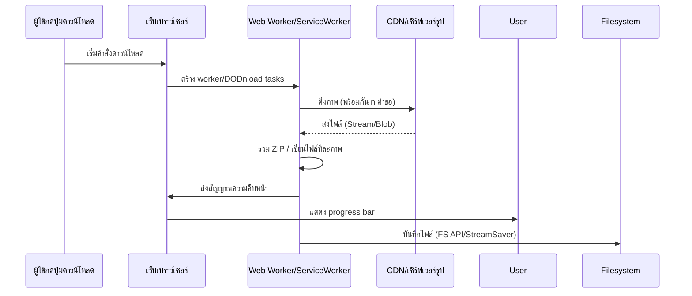

# สรุปแนวทาง (Executive Summary)

การดาวน์โหลดรูปภาพจำนวนมากอย่างรวดเร็วบนเว็บและมือถือสมัยใหม่ต้องอาศัย **สถาปัตยกรรมและเทคนิคหลายระดับ** ตั้งแต่การจัดเก็บบน CDN/คลาวด์ ไปจนถึงการใช้ API หน้าเว็บอย่าง File System Access และ Web Workers เพื่อหลีกเลี่ยงการบล็อก UI นอกจากนี้ การเลือกใช้ **โปรโตคอลถ่ายโอน** (HTTP/2, HTTP/3, WebTransport) อย่างเหมาะสมก็ช่วยให้ใช้งานสายเน็ตเวิร์กได้เต็มประสิทธิภาพ ในแง่ของแพ็กเกจไฟล์ รูปแบบอย่าง ZIP หรือ Native share/save และโค้ดฝั่งลูกค้า (JavaScript) ควรเลือกให้เหมาะกับแพลตฟอร์มแต่ละตัว เช่น Chrome/Android กับ Safari/iOS ในภาพรวม ควรเน้นให้ประสบการณ์ผู้ใช้ลื่นไหล (มีแถบสถานะ, retry, pause/resume) พร้อมคงคุณภาพภาพสูงที่สุด. รายงานนี้จะเจาะลึกสถาปัตยกรรม โพรโทคอล เทคนิคฝั่งลูกค้า ไฟล์ฟอร์แม็ต มาตรการความปลอดภัย ไลบรารี/SDK และตัวอย่างโค้ด (JS, Swift, Kotlin) ที่เกี่ยวข้องเพื่อเป็นแนวทางเชิงปฏิบัติสำหรับปี 2026. 

## สถาปัตยกรรมที่แนะนำ (Architectures)

- **ฝั่งลูกค้าอย่างเดียว (Client-only)** – เบราว์เซอร์ดึงภาพแต่ละภาพจาก CDN/เซิร์ฟเวอร์พร้อมกันเป็นชุด (ตัวอย่างใช้ `Promise.all` ดึงพร้อมกันหลายไฟล์) แล้วรวมเป็น ZIP หรือบันทึกลงไดเรกทอรีด้วย File System Access API (FS API). ข้อดี: ลดภาระเซิร์ฟเวอร์, รองรับออฟไลน์, ควบคุมคุณภาพไฟล์เต็มที่. ข้อเสีย: เบราว์เซอร์ใช้หน่วยความจำมาก, บน Safari/มือถือ iOS ไม่มี FS API.
- **ฝั่งลูกค้า+เซิร์ฟเวอร์ (Client+Server)** – เว็บส่งคำขอดาวน์โหลดภาพจำนวนมากไปยังเซิร์ฟเวอร์ที่รวมไฟล์ (เช่น สร้าง ZIP บนเซิร์ฟเวอร์) แล้วส่งกลับให้ไคลเอ็นต์. ข้อดี: เบราว์เซอร์เบาภาระหน่วยความจำ, บริการถูกจัดการโดยเซิร์ฟเวอร์ที่ปรับขนาดได้. ข้อเสีย: ต้นทุนเซิร์ฟเวอร์สูง, latency เพิ่ม.
- **ใช้ CDN/คลาวด์สตอเรจ (CDN/Cloud Storage)** – เก็บรูปบน S3/GCS แล้วตั้งค่า *Pre-signed URL* ให้ผู้ใช้ดึงได้ตรง ผ่าน CDN (เช่น CloudFront, Cloudflare) เพื่อความเร็วสูง. ผู้ใช้สามารถดาวน์โหลดทีละภาพจาก URL เหล่านั้นพร้อมกัน. โซลูชันนี้ลดโหลดเครื่องแม่ข่ายและใช้ประโยชน์จาก Edge caching.
- **Streaming/Chunking** – การสร้างไฟล์ดาวน์โหลดแบบไดนามิกโดยใช้ Readable/Writable Stream (ตัวอย่างเช่น StreamSaver.js) เพื่อเขียน ZIP ทีละบล็อกไม่ต้องเก็บทุกไฟล์ใน RAM. ด้านการอัพโหลด หากมีการส่งรูปจากอุปกรณ์ไปเซิร์ฟเวอร์ อาจแบ่งเป็นชิ้น (HTTP chunked หรือ Multipart) เพื่อให้ resume และ retry ได้.
- **ไดอะแกรมสถาปัตยกรรม** – ภาพรวมการไหลของข้อมูลจากผู้ใช้ถึงเซิร์ฟเวอร์/คลาวด์ และการจัดเก็บ/เขียนไฟล์ (ดูแบบสรุปด้านล่าง):

```mermaid
flowchart TB
    ผู้ใช้ -->|คลิกดาวน์โหลด| เว็บแอป
    เว็บแอป -->|GET รายการรูปภาพ| เซิร์ฟเวอร์/คลาวด์
    เซิร์ฟเวอร์/คลาวด์ -->|ส่ง URL รูป| เว็บแอป
    เว็บแอป -->|ดึงภาพจาก CDN (พร้อมกันหลายภาพ)| CDN/เซิร์ฟเวอร์
    CDN/เซิร์ฟเวอร์ --> เว็บแอป
    เว็บแอป -->|Zip หรือ เขียนไฟล์ทีละภาพ| ไดเรกทอรีเครื่องผู้ใช้
```

**ตารางเปรียบเทียบสถาปัตยกรรม:** 

| สถาปัตยกรรม | ข้อดี | ข้อเสีย |
|:-|:-|:-|
| Client-only (JS zip/FS API) | ลดภาระเซิร์ฟเวอร์, ควบคุมจัดเก็บได้, ออฟไลน์ได้ | เสียงหนักที่แอป, หน่วยความจำเบราว์เซอร์สูง, บน Safari/iOS บาง API ใช้ไม่ได้ |
| Client+Server (Zip on server) | เบราว์เซอร์ทำงานเบา, ควบคุมรุ่นไฟล์, รองรับ resume (Range) | ต้นทุนเซิร์ฟเวอร์สูง, latency เพิ่ม, ไม่ออฟไลน์ |
| CDN/Cloud Storage | ความเร็วสูง, scalability, ใช้ CDN ปล่อยโหลด | ขึ้นกับการกำหนด CORS/Signed URL, ต้องจัดการอายุลิงก์ |
| Streaming (StreamSaver) | จัดการไฟล์ใหญ่ ช่วยลด RAM, เขียนไฟล์ต่อเนื่อง | ต้องมี Service Worker, รองรับเฉพาะบางเบราว์เซอร์, ซับซ้อนกว่า |
| Chunked Download/Range | รองรับ resume ลดโหลดซ้ำ, เหมาะกับไฟล์ใหญ่ | ต้องเซิร์ฟเวอร์รองรับ Range, เพิ่มความซับซ้อนเข้าถึงหลายส่วน |

## การถ่ายโอนข้อมูล (Transfer Strategies)

- **การดึงข้อมูลพร้อมกันและจำกัดคู่สาย (Parallel & Concurrency):** เว็บมักเปิดคำขอหลายภาพพร้อมกัน แต่เบราว์เซอร์ตั้งค่า *จำนวนการเชื่อมต่อพร้อมกันต่อโดเมน* ได้จำกัด (HTTP/1.1 ~6 ต่อโดเมน) HTTP/2 ช่วยแก้ปัญหานี้โดย *มักซ์ซิ่ง* (multiplexing) บนการเชื่อมต่อเดียว ทำให้ขนภาพพร้อมกันได้มากขึ้นโดยไม่ต้องเปิด TCP เพิ่ม. การทดลองชี้ว่า **ควบคุมการเรียกซ้ำประมาน 4–6** ต่อเวลาจะใช้ประโยชน์เครือข่ายได้ดีและไม่ overload .
- **HTTP/2 vs HTTP/3 (QUIC):** HTTP/2 รองรับการ multiplexing และ header compression ช่วยลด overhead. HTTP/3 (บน QUIC) ยังเพิ่มความทนทานต่อแพ็คเก็ตสูญเสียและ latency ต่ำกว่า โดยเฉพาะในเครือข่ายระยะไกลหรือคุณภาพต่ำ (แสดงผลได้เร็วกว่า HTTP/2 ~25–50% ในบางเงื่อนไข). เว็บเซิร์ฟเวอร์หลัก และ CDN รายใหญ่ (Cloudflare, AWS CloudFront, Google CDN) รองรับ HTTP/3 เต็มรูปแบบ.
- **WebTransport / WebSockets:** เป็นช่องทางแบบ streaming ทั่วไป (ประโยชน์สำหรับ use-case แบบเรียลไทม์) แต่ไม่ใช่ทางเลือกหลักสำหรับดาวน์โหลดไฟล์จำนวนมาก เพราะขาดฟีเจอร์จัดการช่วงข้อมูลแบบ HTTP/3. หากต้องการ streaming ขนาน การใช้ WebTransport (เบื้องต้นอาจไม่แพร่หลายนักในปี 2026) อาจเป็นทางเลือกใหม่ในการส่งข้อมูลหลายสตรีมพร้อมกัน แต่ต้องตรวจสอบรองรับเบราว์เซอร์.
- **Resume/Range Requests:** หากผู้ใช้หยุดหรือเน็ตหลุด จะกลับมาดึงต่อด้วย HTTP Range ได้ (โดยเฉพาะถ้าใช้ ZIP ขนาดใหญ่หรือวิดีโอ) ช่วยลดซ้ำ. เก็บแต่ละรูปเล็กจุแม้มีเชื่อมต่อซ้ำใหม่. 
- **Background Fetch API:** บน Chrome/Android มี Background Fetch สำหรับดาวน์โหลดไฟล์ใหญ่โดยไม่ต้องเปิดแท็บ ยาว. มันจะดำเนินการดาวน์โหลดต่อแม้ผู้ใช้ offline ชั่วคราว (หยุดเมื่อเน็ตหมด และเริ่มใหม่เมื่อออนไลน์อีกครั้ง). อย่างไรก็ดี แม้กำลังทดสอบอยู่ แต่ยังไม่รองรับบน Safari/iOS (iOS 17 อาจมีการปรับปรุงเล็กน้อย).  
- **ตัวอย่างการเรียกใช้:** ใช้ `fetch()` แบบมี `keepalive` สำหรับ request ใหญ่ (service worker) หรือ stream เช่น `fetch().then(res=>res.body)` เพื่อใช้ Streams API รวมถึงพิจารณาตั้ง HTTP/2 PRIORITY หากควบคุมเซิร์ฟเวอร์ได้.

**ตารางเปรียบเทียบการถ่ายโอน:** 

| วิธีถ่ายโอน | ข้อดี | ข้อจำกัด |
|:-|:-|:-|
| HTTP/1.1 (หลายการเชื่อมต่อ) | ใช้ได้ทุกเบราว์เซอร์ | จำกัดแค่ ~6 concurrent ต่อโดเมน, head-of-line blocking |
| HTTP/2 (multiplex) | Parallel บน connection เดียว, ลด overhead | ประสิทธิภาพสูง, ไม่ต้องรวมไฟล์เป็นตัวเดียว |
| HTTP/3 (QUIC) | ลด latency, ทนต่อ packet loss, เร็วกว่า HTTP/2 ในหลายกรณี | ต้อง TLS/QUIC, ต้องรองรับเบราว์เซอร์/เซิร์ฟเวอร์ |
| WebTransport | multiplex แบบ UDP, เหมาะ real-time | ยังใหม่, ไม่แพร่หลาย (ปี 2026 เริ่มได้บ้างใน Chrome) |
| WebSocket | ใช้งานได้ทุกบราว์เซอร์, full-duplex | ไม่มีการ resume, ไม่ optimized สำหรับไฟล์ใหญ่ |
| Parallel Fetch | โหลดเร็ว saturate เน็ตเวิร์ก | ต้องควบคุม concurrency (ไม่ควรยิง 100 request พร้อมกัน) |
| Background Fetch | ช่วยพักและทำต่อใน background | รองรับจำกัด (Chrome/Android), ไม่รองรับ Safari |

## เทคนิคฝั่งลูกค้า (Client-side Optimization)

- **Web Workers** – ใช้ Worker หรือ Service Worker ในการประมวลผลหนักๆ เช่น สร้าง ZIP รวมไฟล์ ลดการคำนวณบน main thread. ตัวอย่าง: โหลดภาพทุกไฟล์เข้ามาใน Worker แล้ว zip แล้วส่งผลกลับ (หรือใช้ StreamSaver ไปรันใน Worker) เพื่อไม่ให้ UI กระตุก.
- **Service Workers / Cache** – สามารถใช้เก็บภาพใน Cache Storage, ทำ Background Fetch, หรือ StreamSaver ผ่าน service worker ได้. ตัวอย่าง: service worker รับ stream ของ Response แล้ว pipe to FileWriter (StreamSaver).
- **requestIdleCallback** – ใช้สำหรับงานแบ็คกราวด์เมื่อ CPU ว่าง ไม่ส่งผลกระทบต่อ UI. เช่น บริหารคำขอดาวน์โหลดทีละบางส่วนเมื่อเบราว์เซอร์ idle.
- **Offline Image Decoding** – ใช้ [`createImageBitmap`](https://developer.mozilla.org/en-US/docs/Web/API/Window/createImageBitmap) หรือ API ใหม่อย่าง `image.decode()` เพื่อถอดรหัสภาพใน worker แยก (OffscreenCanvas) แทน decode บน main thread, ลดการกระตุกหน้า UI.
- **Lazy Loading** – หากแสดงรูปต่อหน้าจอเป็นระเบียบ (thumbnail) หรือค่อย ๆ โหลดข้อมูลเมื่อใช้, ไม่ต้องดึง 100 ภาพทั้งหมดทันทีถ้ายังไม่แสดง. `` หรือ IntersectionObserver ช่วยได้.
- **ภาพเชิงโปรเกรสซีฟ (Progressive)** – หากภาพเป็น JPEG แบบ progressive, ผู้ใช้จะเห็นรูปพรางๆ ขึ้นก่อนระหว่างโหลด.
- **OffscreenCanvas** – หากต้องปรับขนาดรูป/ประมวลผลภาพ สามารถสร้าง Canvas แยกจาก DOM ใน Worker แล้วทำงานหนักๆ เช่น drawImage หรือ compress ไม่ทำให้ UI ค้าง.
- **UX ปรับปรุง** – อัพเดตสถานะให้ผู้ใช้ทราบ (ดาวน์โหลดอะไรเสร็จ/เหลือกี่รูป) โดยไม่บล็อกหน้าจอ. ใช้ `onprogress` จาก `fetch()` + ReadableStream เพื่อนับ byte ได้ละเอียด. ให้ผู้ใช้หยุด/เร่ง/รีเซ็ต การดาวน์โหลดได้ (retry logic).  
- **ตัวอย่างเทคนิคลดปัญหา UI:** เรียกโหลดและจัดเก็บรูปทีละกลุ่ม (เช่น 5 ภาพ ต่อครั้ง) และใช้ `await new Promise(requestIdleCallback)` แทรกระหว่างงานใหญ่ เพื่อให้ UI มีเวลาว่างประมวลผลอินเตอร์แอคชันอื่นๆ.

## ข้อจำกัดบนมือถือ (Mobile-specific Constraints)

- **Safari บน iOS** – Safari รุ่นปัจจุบัน (จนถึง iOS 16/17) ยัง **ไม่รองรับ File System Access API** ทำให้ไม่สามารถเขียนหลายไฟล์ลงโฟลเดอร์เครื่องผู้ใช้โดยตรง ต้องใช้วิธีอื่น เช่น Zip + ไดอะล็อกดาวน์โหลดทั่วไป หรือแชร์ผ่าน Web Share (ซึ่งอาจบังคับให้ผู้ใช้กดบันทึกแต่ละรูป). Safari บน iOS มีข้อจำกัด background (ไม่มี Background Fetch จน iOS 17, จำกัด active download เมื่อแอปไม่ได้ foreground). หน่วยความจำและ storage จำกัด (IndexedDB บางครั้งต่ำกว่า Desktop).  
- **Chrome บน Android/PWA** – รองรับ File System Access (Android/Chrome) ทำให้ทำงาน multi-file ได้ง่ายขึ้น. มี Background Fetch, Web Share, และ Push API สำหรับ PWA. ควรระวัง quota และ permission: ต้องขอ permission เก็บไฟล์ (WRITE_EXTERNAL_STORAGE/Photos) ถ้าอยากเขียนรูปลง Gallery, ต้องใช้ MediaStore API. PWA บน Android สามารถรัน background task ได้ยาวกว่า iOS.
- **PWA Limitations** – บน Android, PWA ติดตั้งได้และเข้าถึงบาง API (FS Access, background tasks) ได้กว่าบน iOS. iOS พื้นฐานยังจำกัดมาก (ไม่มี background sync, ไม่มี FS API, ทรัพยากรจำกัด, ไม่มี Web Share Level 2 หรือมีจำกัด).
- **Flow แชร์/บันทึก** – ควรเตรียม UI ต่างๆ ตาม OS: บน iOS อาจแนะนำแชร์รูปผ่าน **Share Sheet** (โดยอาจใช้ Web Share API ระดับ 2 เพื่อแชร์หลายไฟล์ในครั้งเดียวไปยัง Photos หรือแอปอื่น, สนับสนุนเฉพาะในบางเวอร์ชันของ Safari) ส่วน Android ใช้ Share API หรือ Intent จัดเก็บไฟล์ลง Gallery.
- **Quota** – บนมือถือ ผู้ใช้มีพื้นที่จำกัด: ควรตรวจสอบเนื้อที่ว่างก่อนดาวน์โหลด (StorageManager API) หรือให้ผู้ใช้เลือกโฟลเดอร์ (FS API).

## รูปแบบไฟล์และบีบอัด (File Formats & Compression)

- **JPEG** – ทุกเบราว์เซอร์รองรับดี, เหมาะภาพถ่ายทั่วไป. ปรับคุณภาพ (Quality) เพื่อหาสมดุล ระหว่างขนาดไฟล์กับความคมชัด. ใช้ JPEG แบบ **Progressive** เพื่อให้ดูภาพหยาบก่อนระหว่างโหลด. เก็บหรือคัดออก **metadata** (EXIF) ได้ตามต้องการ (เพิ่มขนาดไฟล์หากเก็บ).
- **WebP** – ได้รับการสนับสนุนกว้างขวาง (Chrome, Firefox, Safari ล่าสุด). ให้ขนาดเล็กกว่า JPEG ~20–30% คุณภาพใกล้เคียง. มีทั้ง lossy และ lossless (เหมาะกราฟิก). เลือก WebP หากเน้นขนาดและผู้ใช้ส่วนใหญ่ใช้เบราว์เซอร์ที่รองรับ.
- **AVIF/HEIF** – คุณภาพสูง/ไฟล์เล็กกว่า WebP มาก ทว่าปัจจุบัน Safari (รวม iOS) รองรับ HEIF แต่ AVIF อาจยังจำกัด (ทดสอบ iOS 17). Chrome/Firefox ใช้ AVIF ได้ดี. หากต้องการคุณภาพสูงสุด/ขนาดเล็กสุด ควรโอนย้ายภาพเป็น AVIF ฝั่งเซิร์ฟเวอร์ แต่ต้องมี fallback (JPEG/WebP) สำหรับเบราว์เซอร์ไม่รองรับ. ทดสอบพบว่า AVIF ให้ผลดีกว่า JPEG มาก.
- **PNG** – ไม่เน่าเสีย (lossless) แต่ขนาดใหญ่, เหมาะภาพที่ต้องสูญเสียข้อมูลไม่ได้. ไม่แนะนำสำหรับภาพถ่ายจำนวนมาก.
- **อื่นๆ** – JPEG XL (ใหม่ กำลังถูกนำมาใช้, Safari บางรุ่นรองรับ), TIFF, BMP ใช้น้อย. เน้นภาพขนาดใหญ่ใช้ JPEG/AVIF/WebP.
- **คุณภาพ vs ขนาด** – ตั้ง quality ประมาณ 80–90% (JPEG) จะได้ลักษณะ “ไม่แตก” แต่ลดขนาดได้มาก. ปรับรูปขนาดก่อนดาวน์โหลด (เช่น ลดความละเอียด) บางกรณีช่วยลดเน็ตเวิร์ก. 
- **Metadata** – ถ้าภาพ invoice อาจมีข้อมูลส่วนตัว (เวลาถ่าย, ตำแหน่ง) ควรล้างก่อน (privacy) หรือนำไป compress encoder options ทั้งนี้ขึ้นกับนโยบายความปลอดภัย. 

## การบรรจุและการเก็บไฟล์ (Packaging Options)

- **ZIP รวมหลายไฟล์** – วิธีนิยมบรรจุภาพทั้งหมดในไฟล์ ZIP แล้วให้ผู้ใช้ดาวน์โหลดครั้งเดียว เช่น ใช้ไลบรารี JSZip หรือ zip.js สร้าง ZIP ฝั่งไคลเอ็นต์, จับ URL ของรูปดึง Blob แล้วเพิ่มใน Zip. ข้อดี: ผู้ใช้ได้ไฟล์เดียว, จัดเรียงชื่อได้. ข้อเสีย: ถ้า 100 รูป ใหญ่ๆ เบราว์เซอร์อาจหน่วยความจำหมด. จึงมักใช้ร่วมกับ *streaming* (เช่น [StreamSaver.js] เติมข้อมูล ZIP ทันทีไม่เก็บไว้ทั้งหมดใน RAM). บนเซิร์ฟเวอร์ก็สามารถ zip เรียลไทม์แล้วส่ง (Content-Type: application/zip).
- **API ดาวน์โหลดหลายไฟล์** – ปัจจุบันไม่มีมาตรฐาน HTML พื้นฐานให้ดาวน์โหลดหลายไฟล์พร้อมกัน (ไม่มี `<a multiple download>`). ต้องใช้วิธีอื่น เช่น เปิด window/tab ใหม่ 100 อัน (ไม่สะดวก) หรือสร้าง ZIP. 
- **File System Access API** – บนเบราว์เซอร์ที่รองรับ (Chrome, Edge, Android) สามารถใช้ `window.showDirectoryPicker()` ให้ผู้ใช้เลือกโฟลเดอร์และใช้ `getFileHandle()` เพื่อเขียนไฟล์หลายไฟล์ทีละภาพลงในโฟลเดอร์นั้น. ข้อดี: ได้ไฟล์หลายไฟล์แยกกัน, คุณภาพครบ, ไม่ใช้ zip. ข้อเสีย: Safari/iOS ไม่รองรับ.
- **Web Share API (Level 2)** – ฝั่งเว็บแชร์หลายไฟล์ผ่าน native share sheet ได้ (เช่น share รูปภาพหลายรูปไปแอป Photos หรือแอปอื่น). Android/Chrome รองรับหลายไฟล์. Safari บน iOS อาจรองรับบางเวอร์ชั่นแต่ยังจำกัด บางครั้งใช้ได้แค่แชร์ 1 ไฟล์.
- **Multi-part container (เช่น TAR)** – บางสถาปัตยกรรม (ไม่นิยมในเว็บ) อาจส่งไฟล์ด้วย multipart stream แต่ไม่แพร่หลายบนเว็บแอป.
- **เปรียบเทียบแพ็กเกจ:** ZIP & FS API เป็นตัวเลือกหลัก. **ZIP** – universal แต่เขียนใหญ่, **FS API** – ใช้ง่ายแต่รองรับน้อย. **Share API** – สะดวกในมือถือ (แชร์ภาพให้แอป), แต่ user ต้องกด Save เอง.

**ตารางเปรียบเทียบรูปแบบการบรรจุ:** 

| วิธีบรรจุ | ข้อดี | ข้อจำกัด |
|:-|:-|:-|
| ZIP ไซด์คลิ้นท์ (JSZip/zip.js) | รองรับทุกเบราว์เซอร์ (โหลดซ้ำครั้งเดียว), ใช้ได้ทั้ง Desktop/Mobile | ต้องหน่วยความจำสูง, ต้อง download ก่อนเปิด, Safari iOS อาจโหลด ZIP ใหญ่ได้ช้า |
| Streaming ZIP (StreamSaver) | ไม่ต้องเก็บ Zip ใน RAM, แสดง progress ได้, รองรับไฟล์ใหญ่ | ต้องมี Service Worker, รองรับเฉพาะ Chromium (Chrome/Edge) | 
| File System Access API | บันทึกเป็นหลายไฟล์ในโฟลเดอร์, คุณภาพเต็ม, ไม่ต้อง unzip ให้ผู้ใช้ | รองรับ Chrome/Android เท่านั้น, Safari/Firefox/มือถือ iOS ไม่รองรับ | 
| Web Share (หลายไฟล์) | แชร์เป็นไฟล์ภาพให้แอปหรือไลบรารีอื่น ๆ, UX mobile ลื่นไหล (คล้าย native) | ต้องรองรับ Web Share Level 2 (Android Chrome โอกาสสูง, Safari เริ่มรองรับ iOS16+), ผู้ใช้ต้อง "บันทึกเอง" |
| Multi-download sequential | ง่ายสุด (window.open แต่ละไฟล์) | แย่ UX, ไม่แพร่หลาย, ต้องสั่ง 100 คลิก |

## ประสบการณ์ผู้ใช้ (UX Patterns)

- **แสดงสถานะ (Progress / Feedback):** ในหน้าจอควรมีแถบความคืบหน้าของการดาวน์โหลดทั้งชุด (เช่น “10/100 รูปดาวน์โหลดแล้ว”). สามารถรายงานอัตราการถ่ายโอน (เช่น MB/s) หรือเปอร์เซ็นต์รวม. ข้อมูลนี้ช่วยผู้ใช้ทราบงานเสร็จถ้วนหรือไม่.
- **Pause/Resume และ Retry:** ให้ผู้ใช้สามารถหยุดหรือพักการดาวน์โหลด (กรณีเน็ตหมด) และเริ่มใหม่ได้ (เช่น Background Fetch API ช่วย pause/continue, หรือ implement เองด้วยการแบ่งภาพเป็นส่วน). หากการดาวน์โหลดบางภาพล้มเหลว ให้ retry แบบเฉพาะภาพนั้นหรือทั้งหมด.
- **Deduplication:** ก่อนเริ่ม ควรตรวจสอบว่าผู้ใช้เคยดาวน์โหลดภาพบางอันแล้วหรือไม่ (เช่น เช็คชื่อไฟล์หรือ hash). ถ้าเคย กำหนดไม่ดาวน์โหลดซ้ำหรือแจ้งเลือกใหม่.
- **Selective Download:** อาจให้ผู้ใช้เลือกดาวน์โหลดรูปเฉพาะบางส่วน (checkbox) หรือ filter ผ่าน metadata (เช่น สรุปเดือน, ป้ายสถานะ). เหมาะกับกรณี 100 รูปแต่ไม่จำเป็นต้องเอาทั้งหมด.
- **แสดงตัวอย่าง/ปรับขนาด:** หากเครือข่ายช้า อาจดึง “รุ่นย่อ” (thumbnail) มาดูผลก่อน แล้วดาวน์โหลดเต็มทีหลัง.
- **Notify/Share:** หาก PWA มี permission ก็สามารถ *share* ให้แอปอื่น เช่น ส่งภาพไป Google Photos ผ่าน Intent (Android) หรือเปิด Share Sheet (iOS).
- **กรณีปัญหา:** แจ้ง error ชัดเจน (CORS, disk space, permission ขัดข้อง) พร้อมคำแนะนำ (รีเฟรช, ตรวจสอบพื้นที่).

## ความปลอดภัยและความถูกต้อง (Security & Integrity)

- **CORS:** เมื่อดึงภาพจากโดเมนต่าง (เช่น CDN) ต้องตั้ง `Access-Control-Allow-Origin` และ header ที่จำเป็น หากเบราว์เซอร์ถูกใช้ในหัวข้อ `fetch` (ไม่เช่นนั้นบางเบราว์เซอร์จะ block JavaScript ไม่ให้เข้าถึงเนื้อหา blob).
- **เซ็นชื่อ URL (Signed URLs):** ถ้ารูปอยู่ใน S3/GCS แบบไม่ public ควรใช้ pre-signed URL ให้ไคลเอ็นต์ดาวน์โหลด ในเวลาจำกัด เพื่อความปลอดภัย. 
- **การพิสูจน์ตัว (Auth):** ถ้าเว็บนี้ private หรือผู้ใช้ login, ให้ validate token/cookie อย่างเหมาะสม (เช่น ใช้ AWS Cognito / Firebase Auth กับ signed URL).
- **TLS/HTTPS:** ทุกการเชื่อมต่อควรเข้ารหัส HTTPS ป้องกันดักฟังข้อมูล. นอกจากนี้ไฟล์ในที่เก็บคลาวด์ควรเข้ารหัส at-rest (โดยผู้ให้บริการคลาวด์ทำให้).
- **ตรวจสอบความสมบูรณ์:** สามารถแนบค่า checksum (เช่น MD5 ของไฟล์แต่ละภาพ) ให้เว็บยืนยันหลังดาวน์โหลดว่าไฟล์ไม่เสียหาย.
- **Privacy (ข้อมูลส่วนบุคคล):** ถ้ารูปมีข้อมูลส่วนตัว ให้พิจารณารวมการเข้ารหัส (aes) ใน transport หรือก่อน (เช่น zip+รหัสผ่าน) ขึ้นอยู่กับความจำเป็น.
- **ขั้นตอน share/save:** บนมือถือ ต้องตรวจสอบ permission เขียนไฟล์/รูป (เช่น Android 11+ ต้องใช้ MANAGE_EXTERNAL_STORAGE หรือ MediaStore) ก่อน. 

## ไลบรารี, SDK, เครื่องมือ (Libraries/SDKs & Tools)

- **JavaScript/เว็บไลบรารี:** 
  - [JSZip](https://stuk.github.io/jszip/) – สร้าง ZIP ฝั่งไคลเอ็นต์ (ง่ายสุดในการรวมไฟล์เล็ก).
  - [zip.js](https://gildas-lormeau.github.io/zip.js/) – ZIP บนเว็บ, สนับสนุน streams และไฟล์ใหญ่.
  - [StreamSaver.js](https://github.com/jimmywarting/StreamSaver.js) – สร้าง WritableStream ไปยังไฟล์, ช่วยบันทึกไฟล์ใหญ่โดยไม่ใช้ RAM.
  - [FileSaver.js](https://github.com/eligrey/FileSaver.js) – ดาวน์โหลด Blob หรือไฟล์เดี่ยว.
  - [browser-fs-access](https://github.com/GoogleChromeLabs/browser-fs-access) – ไลบรารีจาก Google สะดวกในการใช้ FS API (ครอบ `showSaveFilePicker`, `showDirectoryPicker`).
  - [workbox](https://developers.google.com/web/tools/workbox) – จัดการ caching, background sync (นำมาใช้กับ ServiceWorker).
- **Server/Cloud SDK:** 
  - AWS S3 SDK, Google Cloud Storage SDK, Azure Blob Storage SDK – สำหรับสร้าง presigned URLs, อัพโหลด/ดาวน์โหลดรูป.
  - [Sharp](https://sharp.pixelplumbing.com/) หรือ [ImageMagick] – แปลง/ลดขนาด/บีบอัดภาพบนเซิร์ฟเวอร์.
- **iOS (Swift):** 
  - **URLSession** – ดาวน์โหลดไฟล์ หลายแบบ (dataTask, downloadTask). รองรับ background download (ตั้งค่า `URLSessionConfiguration.background`).
  - [Alamofire](https://github.com/Alamofire/Alamofire) – HTTP library ยอดนิยม, ทำ concurrent download, resume ได้.
  - [Kingfisher](https://github.com/onevcat/Kingfisher) – จัดการโหลดและแคชรูป ถ้าต้องโหลดรูปโชว์หรือแคช.
  - **PhotoKit (PHPhotoLibrary)** – บันทึกรูปลง Photos; ต้องขอสิทธิ `PHPhotoLibrary.requestAuthorization`.
- **Android (Kotlin):** 
  - **OkHttp/Retrofit** – โหลดไฟล์แบบ concurrent, resume (ใช้ OkHttp range).
  - [WorkManager](https://developer.android.com/topic/libraries/architecture/workmanager) – จัดการงานดาวน์โหลดในเบื้องหลัง (resumable, constraints).
  - [Glide/Coil/Fresco](https://coil-kt.github.io/coil/) – โหลดและแสดงรูป (Coil ล่าสุดรองรับ WebP/AVIF).
  - **DownloadManager** – API พื้นฐานของ Android สำหรับดาวน์โหลดไฟล์ใหญ่ (แต่ควบคุมได้น้อย).
  - **MediaStore** – บันทึกรูปลง Gallery (สืบค้น `MediaStore.Images.Media.insertImage`).
- **เครื่องมือวัดประสิทธิภาพ:** 
  - Chrome DevTools (Network tab, Performance).
  - Lighthouse audits (PWA, Core Web Vitals).
  - Fiddler/Wireshark (วิเคราะห์การเชื่อมต่อ HTTP).
  - AWS/GCP monitoring (เช่น S3 transfer metrics).

## ตัวชี้วัดประสิทธิภาพ (Performance Metrics)

- **Throughput (ความเร็ว)** – วัดใน MB/s หรือ รูปต่อวินาที (บนเน็ตเวิร์กเฉลี่ยทั่วไป เช่น 4G, Wi-Fi). เป้าหมายคือให้ใช้ความจุเน็ตเวิร์กได้เต็มที่ (ถ้า 100 Mbps, ควรทำ ~10+ MB/s ได้). 
- **Latency (หน่วง)** – เวลาเริ่มต้น, TTFB ของคำขอแต่ละรูป. HTTP/3 มักลด TTFB บนเครือข่ายเส้นไกล.
- **ความหน่วง CPU/หน่วยความจำ** – ตรวจสอบ Memory ใช้ขณะ zip หรือ decode (ควรให้ต่ำที่สุด เพื่อหลีกเลี่ยง OOM). ใช้ Chrome Task Manager ดู memory ของ tab.
- **แบตเตอรี่ (Battery)** – งานหนักเช่น decode ภาพ อาจกินพลังงานสูง. ควรใช้ประสิทธิภาพของเครือข่ายให้เต็ม ประมาณ parallel ไม่เกินจำเป็น. ทดสอบบนอุปกรณ์จริงด้วย.
- **เป้าประสิทธิภาพ** – เช่น ให้ดาวน์โหลด 100 รูปแต่ละรูป ~2MB เสร็จภายใน 10 วินาที (ต้องพิจารณาความเร็วผู้ใช้และ 4G vs Wi-Fi). อาจตั้งเป้าให้คอนเทนเน็กชันดาวน์โหลดที่ 50–80% ของความเร็วสูงสุด.
- **การทดสอบ** – ใช้เครื่องมือเช่น [WebPageTest](https://webpagetest.org/) หรือ [Lighthouse](https://developers.google.com/web/tools/lighthouse) บนโมบายและเดสก์ท็อปวัดเวลาทั้งหมดจนโหลดเสร็จ และ Core Web Vitals ถ้ามีหน้าแสดงตัวอย่าง.
- **การเปรียบเทียบ** – ใช้เน็ตเวิร์กจำลอง (Network Throttling) เพื่อดูผล HTTP/2 vs HTTP/3.



## ตัวอย่างโค้ด (Code Snippets)

- **Web (JavaScript, บันทึก ZIP):** 

  ```js
  async function downloadImagesAsZip(urls) {
    // ใช้ StreamSaver เพื่อไล่ stream ลงไฟล์ zip โดยไม่ใช้ RAM มาก
    const fileStream = streamSaver.createWriteStream('images.zip');
    const zipWriter = new zip.ZipWriter(new zip.WritableStream(zip => fileStream.write(zip)));
    for (let url of urls) {
      const resp = await fetch(url);
      const blob = await resp.blob();
      // เขียนแต่ละไฟล์ใน zip
      await zipWriter.add(url.split('/').pop(), new zip.BlobReader(blob));
    }
    await zipWriter.close();
    fileStream.close();
  }
  ```
  (ตัวอย่างนี้ใช้ [zip.js](https://gildas-lormeau.github.io/zip.js/) ผสมกับ [StreamSaver](https://github.com/jimmywarting/StreamSaver.js) เพื่อไดเรกต์เขียนไฟล์)  

- **iOS (Swift, URLSession + PHPhotoLibrary):** 

  ```swift
  import UIKit
  import Photos

  func downloadImages(urls: [URL]) {
      let session = URLSession(configuration: .default)
      let dispatchGroup = DispatchGroup()
      var images: [UIImage] = []

      for url in urls {
          dispatchGroup.enter()
          let task = session.dataTask(with: url) { data, _, error in
              if let d = data, let img = UIImage(data: d) {
                  images.append(img)
              }
              dispatchGroup.leave()
          }
          task.resume()
      }

      dispatchGroup.notify(queue: .main) {
          // บันทึกลงอัลบั้มรูป
          PHPhotoLibrary.shared().performChanges {
              for img in images {
                  PHAssetChangeRequest.creationRequestForAsset(from: img)
              }
          } completionHandler: { success, error in
              // แจ้งผลผู้ใช้
          }
      }
  }
  ```
  (โค้ดโหลดภาพทีละไฟล์พร้อมกัน หลายตัว โดยใช้ `DispatchGroup` รอจบทุก `dataTask` แล้วบันทึกลง Photos Library)

- **Android (Kotlin, Coroutine + MediaStore):**

  ```kotlin
  import kotlinx.coroutines.*
  import okhttp3.OkHttpClient
  import okhttp3.Request
  import android.provider.MediaStore
  import android.content.ContentValues
  import android.content.Context

  fun downloadAndSaveImages(context: Context, urls: List<String>) {
      val client = OkHttpClient()
      CoroutineScope(Dispatchers.IO).launch {
          for (url in urls) {
              val request = Request.Builder().url(url).build()
              val resp = client.newCall(request).execute()
              resp.body?.byteStream()?.use { stream ->
                  // สร้างชื่อใหม่
                  val filename = url.substringAfterLast("/")
                  // ตั้งค่าข้อมูล metadata สำหรับ MediaStore
                  val values = ContentValues().apply {
                      put(MediaStore.Images.Media.DISPLAY_NAME, filename)
                      put(MediaStore.Images.Media.MIME_TYPE, "image/jpeg")
                  }
                  val uri = context.contentResolver.insert(MediaStore.Images.Media.EXTERNAL_CONTENT_URI, values)
                  uri?.let {
                      context.contentResolver.openOutputStream(it).use { out ->
                          stream.copyTo(out!!)
                      }
                  }
              }
          }
      }
  }
  ```
  (ใช้ OkHttp โหลดข้อมูลไบต์ทีละไฟล์ จากนั้นใช้ MediaStore เขียนรูปลง Gallery บนแอนดรอยด์)

## การเปรียบเทียบ (Summary Tables)

**สถาปัตยกรรม:**  
| แนวทาง | ความซับซ้อน | ประสิทธิภาพ | รองรับ (Desktop/Mobile) |
|:-|:-|:-|:-|
| **Client-only (JS)** | **ต่ำ** – พัฒนาเร็ว, ใช้ไลบรารี JS existing | เครือข่ายได้เต็มที่, UI ตอบสนองดี (ถ้าใช้ Worker) | ทั่วไป (ยกเว้น FS API บางอย่างบน iOS) |
| **Client+Server** | ปานกลาง – ต้องมี backend คิดหนัก | ไคลเอ็นต์เบาภาระ, ใช้เซิร์ฟเวอร์ทำงานหนัก | ทุกแพลตฟอร์ม (หากมี backend) |
| **CDN/Cloud** | ปานกลาง – จัดการ bucket, presign | รองรับโหลดสูง, latency ต่ำ | ขึ้นกับเน็ตเวิร์ก, ต้องจัดการ CORS |
| **Streaming ZIP** | สูง – ซับซ้อนกว่า JSZip | ลด RAM, ทำงานสมูทกว่า กับไฟล์ใหญ่ | จำกัด Chrome/Android เท่านั้น |
| **FS API (Directory)** | ปานกลาง – ใช้ API ใหม่ | เขียนหลายไฟล์สด, ง่ายต่อ UI | Chrome/Edge/Android ที่รองรับ (iOS ไม่มี) |

**โพรโทคอลถ่ายโอน:**  
| โปรโตคอล | ผ่านกลาง (CDN) | Concurrent | Resume | การเข้าถึง | หมายเหตุ |
|:-|:-|:-|:-|:-|:-|
| HTTP/1.1 | ✅ | จำกัด ~6 ต่อโดเมน | ✅ (Range) | ทุกเบราว์เซอร์ | เก่า, overhead สูง |
| HTTP/2 | ✅ | multiplex ✓ | ✅ (Range) | ทุกเบราว์เซอร์หลัก | ดีขึ้น, overhead ต่ำ |
| HTTP/3 (QUIC) | ✅ | multiplex ✓ | ✅ | ใช้มากบน Chrome/Edge/Android | เร็วกว่า HTTP/2, ทนต่อ packet loss |
| WebTransport | ✕ (ต้องเซิร์ฟเวอร์รองรับ) | ✓ (streams) | ✓ | ใหม่, Chrome 105+ | การใช้งานยังเฉพาะกลุ่ม |
| WebSocket | ✕ | ✓ | ✕ | ทุกเบราว์เซอร์ | ไม่เหมาะงานดาวน์โหลดไฟล์ใหญ่ |

**ตัวเลือกแพ็กเกจดาวน์โหลด:**  
| วิธี | UX | การสนับสนุน | เหมาะกับ |
|:-|:-|:-|:-|
| ZIP (JS, server) | ผู้ใช้ดาวน์โหลดไฟล์เดียว | Desktop/Mobile ทั่วไป | เมื่อผู้ใช้ต้องการเก็บเป็นไฟล์เดียวง่าย |
| Multiple files (FS API) | ผู้ใช้เลือกโฟลเดอร์| Chrome/Android | ถ้าโฟลเดอร์เป้าหมายชัดเจน, ให้ผู้ใช้ติดตั้ง PWA |
| Multiple files (Share API) | แชร์ไปแอปอื่นๆ | Android Chrome > iOS14+ | ใช้สำหรับแชร์ถึงแอปถัดไป, ไม่บันทึกโดยตรง |
| Sequential <a> tags | ซับซ้อน UX, แท็บหลายอัน | ทั่วไป | เฉพาะระบบเล็กๆ, ไม่แนะนำ |

## สรุป

การดาวน์โหลดจำนวนมากต้องใช้แนวทางผสมผสาน: ใช้ **CDN/Cloud storage** เก็บรูปหลักให้เร็ว, ใช้ **HTTP/2/3** ถนอมเวลาโหลด, และใช้ **เทคนิคฝั่งลูกค้า** (Web Worker, FS API, StreamSaver) เพื่อไม่บล็อก UI. บนมือถือต้องระวังข้อจำกัด Safari/iOS โดยอาจใช้ fallback เช่น ZIP หรือ Web Share ร่วมกับ Native code (Swift/Kotlin) ตัวอย่าง. ใช้ **รูปแบบไฟล์** ล้ำหน้า (WebP/AVIF) ลดขนาด แต่ต้องพร้อมสำหรับ fallback JPEG. สำหรับโค้ด ทีมพัฒนาอาจผสม JS และ Native SDK (iOS/Android) เพื่อให้ประสบการณ์ผู้ใช้ไร้รอยต่อ. อย่างไรก็ดี การทดสอบจริงบนเครือข่ายและอุปกรณ์เป้าหมายมีความสำคัญ เพื่อปรับแต่งความเร็ว ความลื่นไหล และการอนุญาตที่จำเป็น (เช่น การเขียนไฟล์). 

**อ้างอิง:** แหล่งที่มาอ้างอิงเป็นเอกสารหลัก (MDN, Chrome Dev, Cloudflare, บทความบริษัทฯ) เพื่อความถูกต้องทางเทคนิค.