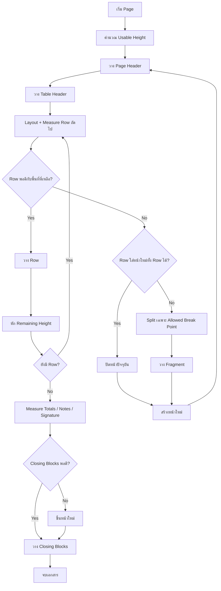
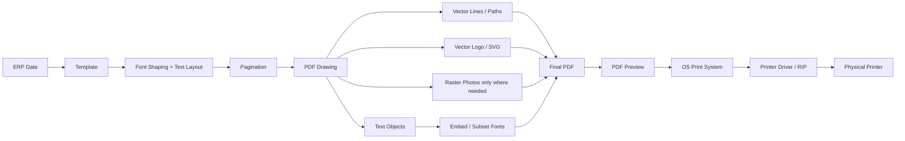
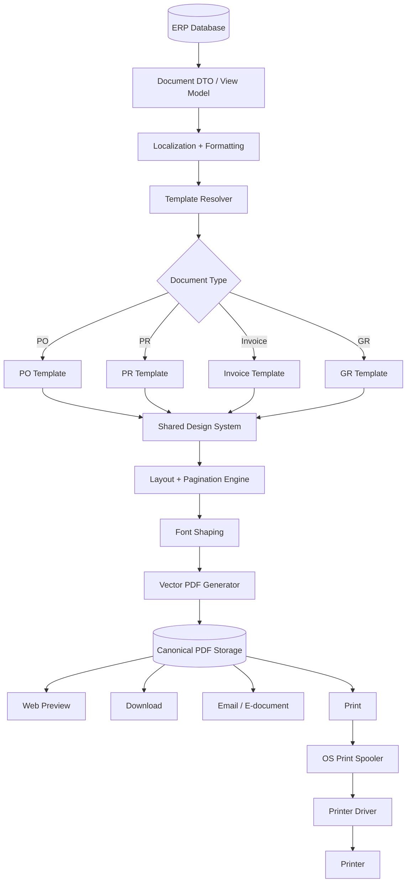

# มาตรฐานการพิมพ์รายงานจากโปรแกรม ERP/Accounting ในปี 2026: PDF, Pagination, ความคม, ฟอนต์ไทย และสถาปัตยกรรมที่ระบบระดับโลกใช้

## บทสรุปสำหรับตัดสินใจ

คำตอบสำคัญที่สุดก่อนคือ **ไม่มีมาตรฐานสากลฉบับเดียวที่บอกว่า “ทุกโปรแกรมต้องทำ PDF ก่อนพิมพ์” หรือ “A4 ต้องมี 40 แถวต่อหน้า”** มาตรฐานอย่าง ISO และ W3C กำหนดเรื่องขนาดกระดาษ, PDF, page layout, page breaking และ accessibility แต่ไม่ได้บังคับ architecture ของโปรแกรมว่าจะต้องเป็น PDF-first หรือ direct print. ISO 32000-2:2020 ซึ่งเป็นมาตรฐาน PDF 2.0 และยังถูก ISO review/confirmed ว่ายัง current ในปี 2026 ระบุเป้าหมายของ PDF ว่าเป็นรูปแบบเอกสารที่แลกเปลี่ยน ดู และพิมพ์ได้โดยไม่ขึ้นกับ environment ที่สร้างเอกสารนั้นขึ้นมา. citeturn27view5

สำหรับระบบใหม่ประเภท **ERP / Accounting / PO / PR / GR / Invoice / Tax Invoice / Receipt / Quotation** ถ้าต้องการผลลัพธ์ที่ “หน้าตาเหมือนกันทุกเครื่อง, พิมพ์คม, ส่งอีเมลแล้วเหมือนที่เห็น, ดาวน์โหลดเก็บได้, audit ได้” สถาปัตยกรรมที่ผมแนะนำในปี 2026 คือ:

> **Structured Data → Document Template → Layout/Pagination Engine → Vector PDF → Print Preview → OS/Printer Driver → Printer**

โดยเก็บ **PDF เป็น canonical printable artifact** ของเอกสารสำคัญ แล้วให้ผู้ใช้ preview/download/email/print จาก PDF เดียวกัน แทนที่จะให้ browser หรือเครื่อง client จัดหน้าใหม่ทุกครั้งที่กด Print. แนวทางนี้สอดคล้องกับจุดประสงค์ของ PDF ที่ ISO นิยามไว้ และ Oracle Analytics Publisher รุ่นเอกสารเดือนมีนาคม 2026 ก็เรียกระบบของตนตรง ๆ ว่าเป็นระบบสร้าง **pixel-perfect reports**; Oracle ยังระบุ PDF output เป็น output ที่ optimized for printing. citeturn27view5turn19view3turn22search0

แต่ **Direct Print ไม่ได้ผิดหรือ obsolete**. Electron ในปัจจุบันมีทั้ง `webContents.print()` สำหรับส่งเข้า printing system โดยตรง และ `webContents.printToPDF()` สำหรับสร้าง PDF โดยรองรับ A0–A6, Letter, Legal, orientation, margins, scale และ page ranges. Direct print ยังมีค่า horizontal/vertical DPI, duplex, copies, collate และ device selection. นั่นเป็นหลักฐานชัดว่าแม้ framework desktop สมัยใหม่ก็รองรับ **ทั้งสอง pipeline** ไม่ได้บังคับให้เลือกแบบเดียว. citeturn27view0turn27view1

และสำหรับคำถามก่อนหน้านี้เรื่อง

> “A4 แนวตั้งควรกำหนด 40 รายการ/หน้าหรือให้มัน Auto?”

คำตอบคือ **ระบบรายงานทั่วไปที่ออกแบบดีควร paginate จาก “ความสูงจริงของ content” ไม่ใช่จำนวน row แบบ hard-code**. W3C CSS Fragmentation กำหนด break opportunities ระหว่าง table row / table row group และมี `break-inside: avoid` สำหรับพยายามไม่ตัด content ภายใน element ขณะที่ `widows` และ `orphans` ใช้ควบคุมจำนวน “บรรทัดข้อความ” ก่อน/หลัง page break โดยค่าเริ่มต้นใน specification คือ 2—not จำนวนแถวของตาราง. citeturn27view2turn27view6

ดังนั้น:

**❌ ไม่ควรออกแบบ engine ว่า `A4 = 40 rows`, `A5 = 20 rows`**

**✅ ควรออกแบบว่า `pageHeight - margins - headers - footers - reservedBlocks = usableHeight` แล้ววัดความสูงจริงของแต่ละ row หลัง font shaping + wrapping ก่อนตัดหน้า**

ข้อยกเว้นคือ form ที่ทุก row ถูกบังคับให้มีความสูงตายตัวจริง ๆ เช่นแบบฟอร์มช่องตารางสำเร็จรูปหรือกระดาษ pre-printed; ในกรณีนั้น fixed row count เป็น business/form requirement ได้ แต่ **ไม่ใช่มาตรฐาน pagination ทั่วไป**. หลัก breaking ของ W3C เป็น geometry/content-driven ไม่ได้กำหนดจำนวนรายการต่อ A4. citeturn27view2turn27view6

## มาตรฐานกระดาษและหลักคิดเรื่องหน้า

### A4, A5, Portrait และ Landscape ควรเป็น physical page ไม่ใช่ screenshot size

ISO 216 เป็นมาตรฐานสำหรับ trimmed sizes ของกระดาษงาน administrative, commercial และ technical; A-series จึงเป็นฐานของ A4/A5 ที่ใช้งานทั่วไป. citeturn2search13 W3C CSS Paged Media ระบุขนาด physical media ชัดเจนว่า **A4 = 210 × 297 mm** และ **A5 = 148 × 210 mm** และสามารถประกาศ orientation เช่น `size: A4 landscape`. citeturn27view3turn27view4

ตัวอย่าง web print stylesheet ที่ควรมีลักษณะนี้:

```css
@page {
  size: A4 portrait;
  margin: 12mm 10mm 14mm 10mm;
}

@media print {
  html,
  body {
    margin: 0;
    padding: 0;
  }

  table {
    width: 100%;
    border-collapse: collapse;
  }

  tr {
    break-inside: avoid;
  }
}
```

W3C ยังระบุว่า named page sizes ใช้ร่วมกับ `portrait` หรือ `landscape` ได้ และยกตัวอย่าง `@page { size: A4 landscape; }` โดยตรง. citeturn27view3turn27view4

นี่มี implication สำคัญมาก:

> **Report template ต้องรู้ “ขนาด physical page” ก่อน layout**

ไม่ควรสร้าง report แบบ responsive screen ก่อน แล้วค่อยหวังว่า `window.print()` จะย่อมันเข้า A4 เอง เพราะ browser/printer settings อาจเลือก scaling ต่างกัน. สำหรับเอกสารธุรกิจที่ต้อง deterministic ควรระบุ `pageSize`, orientation และ margin อย่างชัดเจนใน report metadata/template. Electron เองก็แยก `pageSize`, `landscape`, `scale`, `margins` เป็น explicit PDF-generation options. citeturn27view0

โมเดลที่ผมแนะนำคือ:

```text
ReportDefinition
├── page
│   ├── size: A4
│   ├── orientation: portrait
│   ├── marginTop: 12mm
│   ├── marginRight: 10mm
│   ├── marginBottom: 14mm
│   └── marginLeft: 10mm
│
├── typography
├── documentHeader
├── tableHeader
├── detailRows
├── totals
├── notes
├── signatures
└── pageFooter
```

ถ้าเป็น report กว้าง เช่น inventory aging ที่มี 15–20 columns การใช้ A4 landscape หรือ A3 อาจเหมาะกว่า “บีบ font จาก 9 pt ลงเหลือ 5 pt”. W3C Paged Media รองรับการเลือก size/orientation ตาม content และยกกรณี wide table ที่ใช้ landscape เป็นตัวอย่างด้วย. citeturn27view4

### อย่าใช้จำนวนแถวเป็นตัวกำหนด page break

ลองดู PO สองรายการนี้:

```text
Row 1:
สินค้า A

Row 2:
เครื่องจักรอุตสาหกรรมรุ่น ABC...
พร้อมอุปกรณ์...
เงื่อนไข...
หมายเหตุ...
```

ทั้งสองคือ **1 row** เหมือนกัน แต่ความสูงบนกระดาษไม่เท่ากันเลย

เมื่อมี:

- ภาษาไทย/อังกฤษปนกัน
- description wrap 1–5 บรรทัด
- serial/lot numbers
- discount/tax descriptions
- notes
- product options
- customer-specific descriptions
- dynamic font fallback

คำว่า “40 rows” แทบไม่มีความหมายในเชิง page geometry.

W3C fragmentation model ให้ layout engine เลือก break จาก break opportunities ที่อนุญาต และ table rows เป็นหนึ่งในจุดที่สามารถแบ่ง fragmented flow ได้. `break-inside: avoid` สามารถใช้บอก engine ว่าอย่าตัด element นั้นถ้ายังมีทางเลือกอื่น. citeturn27view2turn27view6

### Pagination ที่เหมาะกับ PO/Invoice จริง ๆ

| วิธี | Logic | ข้อดี | ปัญหา | เหมาะกับ |
|---|---|---|---|---|
| Fixed rows/page | 40 rows → page break | ง่ายมาก | แตกทันทีเมื่อข้อความ wrap | แบบฟอร์ม fixed-height เท่านั้น |
| Estimated row height | ประมาณ row สูงกี่ px | เร็ว | ไทย/font fallback ทำให้คลาดเคลื่อน | preview คร่าว ๆ |
| **Measured-height pagination** | layout + shape + wrap แล้ววัดความสูงจริง | **แม่นและเหมาะกับ ERP** | engine ซับซ้อนกว่า | **PO/PR/Invoice/GR** |
| Browser paged CSS | browser จัด fragmentation | code น้อย | browser implementation ต่างกันบางจุด | web reports |
| Dedicated report/PDF engine | engine คุม page/band/table เอง | deterministic มาก | development/tooling เพิ่ม | enterprise documents |

หลัก W3C เองเป็น flow/fragmentation based ไม่ใช่ fixed item count. citeturn27view2turn27view6

### Algorithm ที่ควรใช้จริง

แนวคิดหลักคือ:

```text
usablePageHeight
    = paperHeight
    - topMargin
    - bottomMargin
    - repeatedPageHeaderHeight
    - repeatedTableHeaderHeight
    - repeatedPageFooterHeight
```

จากนั้น **measure row หลัง layout แล้ว**:

```pseudo
function paginate(document, pageSpec):

    usableHeight =
        pageSpec.height
        - pageSpec.marginTop
        - pageSpec.marginBottom
        - measure(document.pageHeader)
        - measure(document.tableHeader)
        - measure(document.pageFooter)

    pages = []
    page = newPage()
    remaining = usableHeight

    for row in document.rows:

        # สำคัญ:
        # measure หลังจากกำหนด column width,
        # font, shaping, wrapping และ line-height แล้ว
        rowLayout = layoutAndMeasure(row)
        rowHeight = rowLayout.height

        reserveAfter =
            requiredKeepTogetherSpaceAfter(row)

        if rowHeight + reserveAfter <= remaining:
            page.add(rowLayout)
            remaining -= rowHeight
            continue

        # row ใส่หน้าใหม่ทั้งก้อนได้
        if rowHeight <= usableHeight:
            pages.add(page)

            page = newPage()
            repeatPageHeader(page)
            repeatTableHeader(page)

            remaining = usableHeight
            page.add(rowLayout)
            remaining -= rowHeight
            continue

        # row ใหญ่กว่าหนึ่งหน้า
        fragments = splitOversizedRow(
            rowLayout,
            allowedBreakPoints = LINE_BREAKS,
            minLinesAtBottom = 2,
            minLinesAtTop = 2
        )

        for fragment in fragments:

            if fragment.height > remaining:
                pages.add(page)

                page = newPage()
                repeatPageHeader(page)
                repeatTableHeader(page)

                remaining = usableHeight

            page.add(fragment)
            remaining -= fragment.height

    # totals / VAT / grand total / signatures
    closingHeight = measure(document.closingBlocks)

    if closingHeight > remaining:
        pages.add(page)
        page = newPage()
        repeatPageHeader(page)

    page.add(document.closingBlocks)
    pages.add(page)

    return pages
```

`minLinesAtBottom/minLinesAtTop = 2` ใน pseudocode ข้างบนสัมพันธ์กับแนวคิด widows/orphans แต่ต้องเข้าใจว่า W3C นิยาม widows/orphans กับ **line boxes ใน block container** ไม่ใช่กฎว่า table ต้องเหลือสอง rows. citeturn27view6

### Keep-together ที่ควรมี

สำหรับเอกสาร ERP ผมแนะนำ policy เช่น:

```text
Item row                 → avoid split
Short description        → keep entire row
Very long description    → allow split only at line boundaries
Subtotal                 → keep with next
VAT                       → keep with grand total
Grand total              → keep together
Signature heading        → keep with signature area
Table header             → repeat every page
Page footer              → fixed/repeated every page
```

กฎพวกนี้เป็น application/report-design policy ไม่ใช่ตัวเลขที่ ISO บังคับ แต่สอดคล้องกับ fragmentation model ซึ่งแยก forced/unforced breaks และ `break-inside: avoid`. citeturn27view2turn27view6



## ทำอย่างไรให้ตัวหนังสือและเส้น “คมจริง” ไม่เบลอไม่ฟุ้ง

สิ่งที่ต้องแยกให้ออกก่อนคือ **คุณภาพ PDF กับ DPI ของเครื่องพิมพ์เป็นคนละ layer**

PDF ถูกมาตรฐาน ISO 32000 ออกแบบให้เป็น representation ของ electronic document ที่สามารถ view/print ได้ข้าม environment. citeturn27view5 Electron จึงมีความแตกต่างที่น่าสนใจ: `print()` มี option ของ printer DPI โดยตรง แต่ `printToPDF()` เน้น page size, orientation, margins และ scale เพราะไฟล์ PDF ยังไม่ผูกกับเครื่องพิมพ์ physical ตัวหนึ่ง. citeturn27view0turn27view1

### Pipeline ที่ควรเป็น



สำหรับ PO/Invoice สิ่งที่ควรหลีกเลี่ยงมากที่สุดคือ:

```text
HTML
 ↓
Screenshot 2480 × 3508
 ↓
JPEG/PNG
 ↓
ใส่ภาพทั้งหน้าเข้า PDF
 ↓
Print
```

เพราะใน architecture แบบนี้ **ตัวหนังสือและเส้นกลายเป็น pixels ไปแล้ว**. การ zoom หรือการพิมพ์ที่ resolution สูงขึ้นไม่ได้คืน outline ของตัวอักษรหรือ geometry ของเส้นกลับมา.

สิ่งที่ควรเป็นคือ:

```text
Text        → PDF text/glyphs
Table lines → vector strokes
Logo        → SVG/vector ถ้าเป็นไปได้
Barcode     → vector หรือสร้างโดยความละเอียดที่เหมาะสม
Photo       → raster image
```

Adobe ระบุว่า Acrobat Reader เปิด PDF โดยรักษา fonts, layouts และ embedded content ตามที่ออกแบบไว้ และ Adobe PDF Library มีการรองรับ font embedding/subsetting. citeturn26search37turn28search19

### Font embedding สำคัญมาก

ถ้า PDF บอกเพียง:

```text
font-family: "My Thai Font"
```

แต่ไม่ได้ embed font และเครื่องปลายทางไม่มี font นั้น ก็เปิดช่องให้เกิด font substitution ซึ่งอาจเปลี่ยน:

- glyph
- character width
- line wrap
- row height
- page break
- ตำแหน่งวรรณยุกต์
- จำนวนหน้า

ดังนั้นสำหรับ transactional document ที่ต้อง deterministic ผมแนะนำ:

> **Embed font เข้า PDF และ subset เฉพาะ glyph ที่ใช้เมื่อ library รองรับ**

Adobe PDF Library มีตัวอย่างและ API ในเรื่อง font embedding/subsetting โดยตรง. citeturn28search19

ผลดีเชิง architecture คือ client ไม่จำเป็นต้องติดตั้ง Sarabun/Noto/IBM Plex ตัวเดียวกับ server เพื่อให้ PDF แสดงผลตรงกัน.

### เส้นตาราง

อย่าทำ grid ด้วย bitmap.

ใช้ PDF path/vector stroke หรือ CSS border ที่ PDF renderer เก็บออกมาเป็น vector. สำหรับ business form ผมมักเริ่ม QA ที่เส้นประมาณ:

```text
0.35 pt – 0.5 pt   grid ปกติ
0.75 pt – 1.0 pt   separator สำคัญ
```

นี่เป็น **engineering starting point ไม่ใช่มาตรฐาน ISO**; ต้อง proof กับ printer จริง เนื่องจาก printer/driver/toner/paper ต่างกัน.

หลีกเลี่ยง hairline บางมากแบบ “0.1px” เพราะผลลัพธ์อาจแตกต่างตาม rasterizer และ device.

### DPI ใช้ตรงไหน

Concept ที่ควรจำคือ:

> **Vector text และ vector lines ไม่ควรออกแบบจากคำถามว่า “ภาพนี้กี่ DPI?”**

DPI/PPI สำคัญกับ raster assets และ final printer rasterization มากกว่า. Electron เองสะท้อนความแตกต่างนี้ด้วยการมี `dpi.horizontal` / `dpi.vertical` ใน direct-print options ขณะที่ `printToPDF()` ใช้ page geometry และ scale. citeturn27view0turn27view1

สำหรับรูป raster ให้คำนวณ:

```text
Effective PPI = imagePixels / printedSizeInInches
```

เช่นรูป 1200 px ที่ถูกพิมพ์กว้าง 4 นิ้ว:

```text
1200 / 4 = 300 PPI
```

ผมจะใช้ **ประมาณ 300 PPI เป็น practical baseline สำหรับรูปภาพทั่วไปใน office document** แต่ตัวเลขนี้ไม่ใช่ข้อบังคับ ISO. โลโก้, QR, barcode และ line art ควรเป็น vector ถ้าทำได้ แทนที่จะพยายามแก้ด้วย DPI สูงมาก.

### Anti-aliasing อย่าสับสนกับคุณภาพไฟล์

Anti-aliasing ที่เห็นใน PDF viewer บนจอเป็นการ rasterize เพื่อแสดงผลบน display. PDF ที่มี text/vector อยู่ยังไม่เท่ากับ “ตัวหนังสือถูกเก็บเป็นภาพเบลอ”.

วิธีตรวจแบบง่ายมาก:

**Zoom PDF ไป 800–1600%**

ถ้าขอบ font/table line ยังเรียบและ re-render ตาม zoom → มีแนวโน้มสูงว่ายังเป็น text/vector.

ถ้ากลายเป็น pixel block ใหญ่ ๆ → มีบางส่วนถูก rasterize มาแล้ว.

## ฟอนต์ภาษาไทยสำหรับ PO, PR, Invoice และเอกสารธุรกิจในปี 2026

สิ่งสำคัญกว่า “ฟอนต์ไหนสวยที่สุด” คือ:

> font ต้อง **รองรับภาษาไทยถูกต้อง + license อนุญาตการใช้งาน/embedding + renderer shape วรรณยุกต์ถูก + มี weight ที่ต้องใช้ + metrics คงที่**

### ตัวเลือกที่ผมแนะนำ

| ฟอนต์ | License ที่ตรวจสอบได้ | บุคลิก/ข้อดี | ข้อสังเกต | ความเหมาะสม |
|---|---|---|---|---|
| **Sarabun** | SIL OFL 1.1 | ไทยทางการ อ่านง่าย คุ้นเคยมาก เหมาะเอกสารยาว | รูปลักษณ์ค่อนข้าง formal | **★★★★★ PO/PR/Invoice/Tax docs** |
| **Noto Sans Thai** | SIL OFL 1.1 ใน Noto Thai project | neutral, เหมาะ multilingual, เหมาะระบบสมัยใหม่ | ภาพลักษณ์ modern กว่าเอกสารราชการ | **★★★★★ modern ERP** |
| **IBM Plex Sans Thai** | SIL OFL | corporate/technical มาก สะอาด เหมาะ ERP | อารมณ์ไม่ใช่เอกสารราชการไทย | **★★★★☆ modern corporate** |
| **IBM Plex Sans Thai Looped** | SIL OFL | Thai looped style, เหมาะคนคุ้นรูปแบบตัวไทยดั้งเดิม | footprint/font family เพิ่ม | **★★★★☆ formal/legacy-friendly** |

Noto Thai repository ระบุ SIL Open Font License 1.1 โดยตรง. citeturn24view0

Repository ของ Sarabun ระบุทั้ง OFL 1.1 และอธิบายว่า Sarabun มาจากโครงการฟอนต์แห่งชาติไทย ถูกเลือกใช้ในงานเอกสารภาครัฐ และถูกองค์กรเอกชนนำไปใช้อย่างแพร่หลาย; repo ยังอธิบายว่าเป็น text face สำหรับ formal/long-form reading. citeturn24view1

IBM ระบุว่า IBM Plex เป็น open-source ภายใต้ Open Font License และใน family มีทั้ง **IBM Plex Sans Thai** และ **IBM Plex Sans Thai Looped**. citeturn24view2

### ถ้าผมต้องเลือก font เดียวให้ ERP ไทยใหม่

ผมจะจัดลำดับเป็น:

**Sarabun** — ถ้า PO/PR/Invoice/Tax Invoice เป็นเอกสารหลักและอยากให้ดู “ไทย ทางการ เอกสารธุรกิจ”

หรือ

**Noto Sans Thai** — ถ้าระบบเป็น multinational, ไทย+อังกฤษ+ภาษาอื่น และต้องการ visual system ที่ modern/neutral.

ถ้าองค์กรมี corporate design สมัยใหม่มาก:

**IBM Plex Sans Thai / Thai Looped** เป็นตัวเลือกที่ดีมาก เพราะ IBM ระบุ Thai variants อย่างเป็นทางการและ family อยู่ภายใต้ OFL. citeturn24view2

### ขนาด font ที่แนะนำ

**ไม่มีมาตรฐานสากลที่บอกว่า Invoice ต้องใช้ 9 pt หรือ PO ต้อง 10 pt** ดังนั้นตัวเลขต่อไปนี้คือ practical design baseline สำหรับ ERP ไม่ใช่ข้อบังคับ ISO/W3C:

| ส่วน | ค่าตั้งต้นที่ผมแนะนำ |
|---|---:|
| Dense item table | 8.5–9 pt |
| **Default PO/PR/Invoice body** | **9–10 pt** |
| Customer-facing important text | 10–11 pt |
| Notes ที่ต้องอ่านจริง | 9–10 pt |
| Document title | 14–18 pt |
| Grand total | 10–12 pt + SemiBold/Bold |
| Footer metadata | 8–9 pt |

สำหรับภาษาไทยผมไม่แนะนำให้ลด font ลงเพียงเพราะต้องการให้ “ทุกอย่างอยู่หน้าเดียว”. ให้ pagination ทำงานแทน.

และควรเผื่อ line-height มากกว่าภาษา Latin ที่แน่นมาก เช่น:

```css
body {
  font-family: "Sarabun", sans-serif;
  font-size: 9.5pt;
  line-height: 1.3;
}
```

จากนั้น regression-test คำที่มีเครื่องหมายด้านบนและด้านล่าง เช่น:

```text
กำลัง
น้ำเงิน
สิ่งที่
ผู้ซื้อ
เครื่องจักร
จำนวนทั้งสิ้น
```

เพราะ bug ที่อันตรายไม่ใช่แค่ “อ่านไม่สวย” แต่เป็น **glyph/mark ถูก clip ที่ขอบ line box** แล้วไปปรากฏใน PDF จริง.

### ตัวเลขใน PO/Invoice

สำหรับ column เช่น:

```text
Qty
Unit Price
Discount
VAT
Amount
```

ควร right-align:

```css
.numeric {
    text-align: right;
    white-space: nowrap;
    font-variant-numeric: tabular-nums;
}
```

`tabular-nums` ควรใช้เฉพาะเมื่อ font/rendering engine รองรับ OpenType feature ที่เกี่ยวข้อง; ไม่ควรพึ่ง feature นี้แทนการจัด column geometry.

ตัวอย่าง:

```text
          Qty       Unit Price          Amount
         2.00        1,250.00        2,500.00
        15.00           75.50        1,132.50
       120.00            5.00          600.00
```

ดีกว่า center-align ตัวเลข เพราะผู้ใช้อ่านหลักหน่วย/สิบ/ร้อยและทศนิยมได้เร็วกว่า.

## ฟอร์มกลางหรือทำ Design แยก PO/PR/Invoice

จุดนี้มีคำตอบที่ค่อนข้างชัดจาก architecture ของ enterprise reporting:

> **ไม่ควรเป็น “หนึ่ง template เดียวทำทุกเอกสาร” และก็ไม่ควร “copy-paste design แยกทุกฟอร์มแบบไม่มีของกลาง”**

สิ่งที่เหมาะกว่าคือ:

> **Central Document/Report Framework + Shared Master Components + Document-Specific Templates**

Oracle Analytics Publisher แยกแนวคิด data model และ report layout และ documentation เดือนมีนาคม 2026 เน้นการสร้าง pixel-perfect report layouts. citeturn19view3turn21view0 SAP S/4HANA Cloud มีแนวคิด master form template/custom form template และมี training อย่างเป็นทางการเรื่อง customization ของ corporate master form template. citeturn22search19 Microsoft Dynamics 365 Finance ก็มี Electronic Reporting formats และ Print Management destinations ที่สามารถกำหนด destination ตาม record/report configuration ได้; เอกสาร Microsoft ที่พบถูกอัปเดตในเดือนเมษายน 2026. citeturn22search2

จาก vendor patterns เหล่านี้ ข้อสรุปเชิง architecture ที่สมเหตุสมผลคือ **ใช้ infrastructure/shared form language กลาง แต่ layout ของเอกสารแต่ละชนิดยังแยกกัน**. citeturn19view3turn22search19turn22search2

โครงสร้างที่ผมแนะนำ:

```text
Document Design System
│
├── Page Presets
│   ├── A4 Portrait
│   ├── A4 Landscape
│   ├── A5 Portrait
│   └── Letter
│
├── Shared Typography
│   ├── Sarabun Regular
│   ├── Medium
│   └── Bold
│
├── Shared Components
│   ├── Company Header
│   ├── Logo
│   ├── Company Address
│   ├── Customer/Supplier Block
│   ├── Document Metadata
│   ├── Item Table Header
│   ├── Money Formatter
│   ├── Tax Summary
│   ├── Notes
│   ├── Signature Block
│   └── Page Footer
│
└── Document Templates
    ├── PR
    ├── PO
    ├── GR / Goods Receipt
    ├── Quotation
    ├── Sales Order
    ├── Invoice
    ├── Tax Invoice
    ├── Receipt
    └── Credit/Debit Note
```

### อะไรควรเป็นของกลาง

Company header, logo, address, tax ID formatting, typography, page margins, table styles, money/date formatting, page-number footer, barcode component, signature component, localization และ print QA rules ควรแชร์.

### อะไรควรแยกตามเอกสาร

PR มี requester/department/approval chain

PO มี supplier, payment term, delivery term

GR มี receiving warehouse, received qty, rejected qty

Invoice มี billing address, due date, amounts

Tax Invoice มีข้อมูลตามข้อกำหนดทางภาษีของ jurisdiction

Receipt มี payment methods/reference

ดังนั้นการพยายามสร้าง template แบบ:

```text
UniversalBusinessDocument.html
```

แล้วใส่ `if PO`, `if PR`, `if invoice` หลายร้อยเงื่อนไข มักจบเป็น template ที่ maintenance ยาก.

แบบที่ scale ดีกว่าคือ:

```text
BaseDocument
    ↓
Shared Components
    ↓
PO Template
Invoice Template
GR Template
Receipt Template
```

และสามารถมี variant:

```text
PO
├── TH
│   ├── Company A
│   └── Company B
├── EN
└── JP
```

โดยไม่ fork report engine ทั้งตัว.

## PDF-first, HTML/CSS-to-PDF และ Native Printing ควรเลือกอะไร

ไม่มี winner เดียวทุก use case. Framework อย่าง Electron แสดงชัดว่าระบบสมัยใหม่รองรับทั้ง direct print และ print-to-PDF. Electron `printToPDF()` รองรับ A0–A6, Legal, Letter, Tabloid, Ledger, custom physical dimensions, margins, headers/footers, background graphics, scale และ orientation; `print()` รองรับ DPI, duplex, copies, collate และ printer selection. citeturn27view0turn27view1

| Approach | ความ deterministic | ความคม | Pagination control | Client dependency | เหมาะกับ |
|---|---|---|---|---|---|
| **Dedicated PDF-first** | **สูงมาก** | **สูงมากถ้า text/vector** | **สูง** | ต่ำ | **PO/Invoice/Tax/official docs** |
| Chromium HTML/CSS → PDF | สูงเมื่อ pin engine/fonts | สูง | สูง–กลาง | ต่ำถ้าทำ server-side | web ERP, modern SaaS |
| Browser `window.print()` | กลาง | สูงได้ | กลาง | **สูง** | ad-hoc reports |
| Electron `printToPDF()` | สูง | สูง | สูง | controlled desktop runtime | Electron ERP |
| Electron/native direct print | กลาง–สูง | สูง | app/OS dependent | printer/driver | local office/desktop |
| Raster → PDF | ต่ำสำหรับ text quality | **ต่ำกว่า vector** | คุณคุมเอง | ต่ำ | scan/photo-oriented output |
| wkhtmltopdf | ใช้ได้กับ legacy stack | ใช้ได้ | CSS/WebKit limitations | server binary | legacy systems |

wkhtmltopdf ระบุเองว่าเป็น open-source LGPLv3 command-line renderer ที่แปลง HTML เป็น PDF/image ด้วย **Qt WebKit**. citeturn18search35 สำหรับโครงการใหม่ปี 2026 ผมจะไม่เลือกมันเป็น default renderer หากสามารถใช้ Chromium/current browser rendering stack หรือ dedicated document engine ได้; แต่ระบบ legacy ที่ template ถูกสร้างมารอบ wkhtmltopdf อยู่แล้วอาจมีเหตุผลที่จะรักษา compatibility ไว้.

### Desktop native ไม่ได้หมายถึง “นับแถวเอง”

Microsoft WinUI printing ใช้ `PrintDocument` และมี lifecycle ที่เกี่ยวข้องกับ **Paginate → GetPreviewPage → AddPages** กล่าวคือ application คำนวณหน้า, สร้าง preview และส่ง page set เข้า print system แยกขั้นกัน. เอกสาร Microsoft หน้า “Print from your app” ถูกอัปเดตเมื่อ 4 มีนาคม 2026. citeturn10view3

นั่นตรงกับแนวคิดที่ควรใช้:

```text
layout
   ↓
paginate
   ↓
preview
   ↓
commit print job
```

ไม่ใช่:

```text
rows.length / 40
```

### Mobile ก็คล้ายกัน

Android Print Framework ให้ application สร้าง printable document ผ่าน print framework/adapter และรองรับ custom documents นอกเหนือจาก image/HTML printing. เอกสาร Android ที่พบได้รับการอัปเดตในปี 2025 และยังเป็นกลไก native ที่เกี่ยวข้องกับ Android printing. citeturn11view0

### Architecture ที่ผมแนะนำสำหรับ ERP ใหม่



สำหรับเอกสารธุรกิจที่มี audit significance ผมจะให้ server เป็นผู้สร้าง final PDF เพราะทำให้ renderer version, fonts, template version และ locale อยู่ใน controlled environment เดียวกัน. นี่เป็น architectural recommendation ไม่ใช่ข้อบังคับ ISO.

ตัวอย่าง metadata ที่ควรเก็บร่วมกับเอกสาร:

```json
{
  "documentType": "PURCHASE_ORDER",
  "documentNo": "PO-2026-001234",
  "templateVersion": "po-th-v7",
  "locale": "th-TH",
  "pageSize": "A4",
  "orientation": "portrait",
  "fontFamily": "Sarabun",
  "rendererVersion": "2026.09",
  "generatedAt": "2026-09-19T10:24:31+07:00"
}
```

ถ้าบริษัทต้องการ audit/reproducibility สูง ผมแนะนำเก็บ final PDF ไม่ใช่เก็บแต่ data แล้ว regenerate ในอีกสามปี เพราะ template/font/renderer อาจเปลี่ยน.

## แนวทาง implementation ที่ผมจะใช้จริงในระบบใหม่ปี 2026

### Pipeline หลัก

ผมจะสร้าง `Document Service` แยกออกจากหน้าจอ ERP:

```text
POST /documents/po/{id}/render
```

ภายใน:

```text
1. Query business data
2. Build immutable DocumentModel
3. Apply locale/currency/date formatting
4. Resolve template + version
5. Resolve physical page preset
6. Load bundled fonts
7. Shape text
8. Compute column widths
9. Layout cells
10. Measure rows
11. Paginate
12. Render vector PDF
13. Embed/subset fonts
14. Validate page overflow
15. Store PDF
16. Return PDF/stream
```

จากนั้น Preview กับ Print ใช้ artifact เดียว:

```text
                ┌─ Browser PDF Viewer
Final PDF ──────┼─ Download
                ├─ Email
                ├─ Archive
                └─ Print
```

### ไม่ควร generate PDF จาก DOM screenshot

ถ้า library มี API แบบ:

```javascript
canvas.toDataURL("image/jpeg")
```

แล้วนำ JPEG ไปแปะเต็มหน้า PDF สำหรับ PO/Invoice ผมถือว่าเป็น red flag.

ถ้าต้องใช้ HTML เป็น template ให้ pipeline เป็น:

```text
HTML/CSS
   ↓
Browser layout engine
   ↓
Print/PDF backend
   ↓
PDF text + paths + images
```

Electron/Chromium เป็นตัวอย่าง implementation ที่มี `printToPDF()` โดยตรงแทนการ screenshot หน้า. citeturn27view0

### อย่า Scale-to-fit เป็นวิธีแก้ overflow หลัก

สมมติ invoice ล้น 3 mm แล้วระบบทำ:

```text
scale = 93%
```

หน้าอาจ “พอดี” แต่:

- font เล็กลงทุกอย่าง
- barcode เปลี่ยน physical size
- margins เปลี่ยน
- visual consistency ระหว่าง invoices หาย
- เอกสาร 1 หน้าและ 2 หน้าใช้ font คนละ effective size

ทางที่ถูกกว่าคือ re-pagination.

ใช้ scaling เฉพาะกรณีที่ผู้ใช้ร้องขอ explicit เช่น:

```text
Fit to printable area
```

ไม่ใช่ default business-document layout policy.

### Streaming

PDF ไม่จำเป็นต้องเขียน disk ชั่วคราวทุกครั้ง:

```text
Data
 → Layout
 → PDF writer
 → byte stream
 → HTTP response / object storage
```

สำหรับ report ใหญ่ สามารถ stream/buffer ตามข้อจำกัดของ PDF library แต่ pagination ที่ต้องรู้ page count เช่น `"Page 1 of 97"` อาจต้อง two-pass layout หรือ engine ที่ resolve page count ภายหลัง.

แนวทาง two-pass:

```pseudo
layoutResult = layoutAllPages(document)

for page in layoutResult.pages:
    drawPage(
        page,
        currentPage = page.index + 1,
        totalPages = layoutResult.pages.length
    )
```

นี่ทำให้ footer:

```text
หน้า 17 / 82
```

ไม่ต้องเดาจำนวนหน้าระหว่าง render.

### Header ตารางต้อง repeat

ใน PO 5 หน้า ผู้ใช้อ่านหน้า 4 ไม่ควรต้องย้อนกลับหน้า 1 เพื่อจำว่า column ที่สามคืออะไร.

ทุก page detail ควรมี:

```text
ลำดับ | รหัสสินค้า | รายละเอียด | จำนวน | หน่วย | ราคา/หน่วย | ส่วนลด | จำนวนเงิน
```

แล้ว row ต่อจากหน้าเก่าต้องเริ่มใต้ header ใหม่.

### Signature block ไม่ควรแขวน

ไม่ควรเกิด:

```text
Page 2

...
Grand Total     58,200.00

ผู้จัดทำ: _____________
```

แล้ว:

```text
Page 3

ผู้อนุมัติ: ___________
```

เพราะ block มี semantic relationship.

ให้ calculate signature-group height แล้ว:

```pseudo
if remainingHeight < signatureGroupHeight:
    pageBreak()
renderSignatureGroup()
```

### Totals ควร keep together

ตัวอย่าง:

```text
Subtotal
Discount
Net
VAT 7%
Grand Total
```

ควรพยายามอยู่ block เดียวกัน.

```pseudo
totalsHeight = measure(totalsBlock)

if totalsHeight > remaining:
    newPage()

render(totalsBlock)
```

ไม่ควร hard-codeว่า:

```pseudo
if rowCount > 36:
    newPage()
```

เพราะปัญหาที่กำลังแก้คือ physical space ไม่ใช่ row count.

## Accessibility, Internationalization และ Checklist ก่อน Production

PDF สมัยใหม่ไม่ได้มีแค่ “พิมพ์สวย”. ถ้าองค์กรมี accessibility requirement ปัจจุบันมี **ISO 14289-2:2024 หรือ PDF/UA-2** ซึ่งกำหนดการใช้ PDF 2.0 ตาม ISO 32000-2 เพื่อสร้าง accessible digital documents. citeturn28search4turn28search12

Electron มี option สำหรับ tagged PDF ใน `printToPDF()` แต่ documentation ระบุ feature ดังกล่าวในบริบทของ API และไม่ควรตีความว่าเปิด option แล้วจะผ่าน PDF/UA โดยอัตโนมัติ. citeturn27view0 การ conform PDF/UA ต้องสนใจ document structure, reading order, semantic roles, table structure, alternative text และ metadata ตามมาตรฐานที่เกี่ยวข้อง. citeturn28search4turn28search12

สำหรับ HTML source ผมจึงแนะนำเริ่ม semantic ตั้งแต่ต้น:

```html
<html lang="th">
  <table>
    <thead>
      <tr>
        <th scope="col">รายการ</th>
        <th scope="col">จำนวน</th>
        <th scope="col">ราคาต่อหน่วย</th>
        <th scope="col">จำนวนเงิน</th>
      </tr>
    </thead>
    <tbody>
      ...
    </tbody>
  </table>
</html>
```

### Internationalization

อย่าเก็บ formatted value ลง model เช่น:

```json
{
  "amount": "1,250.00 บาท"
}
```

ควรเก็บ:

```json
{
  "amount": 1250.00,
  "currency": "THB"
}
```

แล้ว formatter ทำ:

```text
th-TH → 1,250.00 บาท / ฿1,250.00 ตาม document policy
en-US → THB 1,250.00
```

วันที่ก็เช่นเดียวกัน:

```text
2026-09-19
```

เป็น source value แล้ว display layer ตัดสินใจว่าจะเป็น:

```text
19 กันยายน 2569
19/09/2569
19 Sep 2026
2026-09-19
```

ไม่ควร hard-code Buddhist/Gregorian calendar ลง database display string เพราะเอกสารคนละชนิดหรือลูกค้าต่างประเทศอาจต้องคนละ convention.

### Regression test ที่ควรมี

เอกสาร renderer ต้องทดสอบมากกว่าหน้าสวยหนึ่งตัวอย่าง. ชุด test ที่ผมจะสร้างมีอย่างน้อย:

```text
0 items
1 item
exactly fills one page
1 pixel/point over one page
2 pages
50+ pages

very long Thai description
very long English word
Thai + English + number mixed
Thai combining marks
negative amount
very large amount
zero amount

missing logo
very tall logo
long company name
long supplier address

A4 portrait
A4 landscape
A5 portrait
Letter

totals near bottom edge
signature near bottom edge
oversized single row
notes longer than one page
```

และทำ visual regression จาก rendered PDF/page image เพื่อจับ bug เช่น:

```text
column shift
text clipping
footer overlap
missing glyph
unexpected page break
table line missing
signature split
```

### Acceptance criteria สำหรับ “คมจริง”

ผมจะกำหนด production gate ประมาณนี้:

| ตรวจ | ต้องได้ |
|---|---|
| Text selectable ใน PDF | **Yes** |
| Search/copy ภาษาไทยได้ | **Yes** |
| Font embedded/subset | **Yes** |
| Missing glyph/tofu | **0** |
| Entire-page rasterization | **No** |
| Table lines เป็น vector | **Yes** |
| A4 physical size | **210 × 297 mm** |
| Content ทับ footer | **0 cases** |
| Table header repeat | **Yes** |
| Normal row split | **No** |
| Oversized row | split ตาม policy |
| Totals split | หลีกเลี่ยง |
| Signature split | หลีกเลี่ยง |
| Thai marks clip | **0** |
| Preview = printed layout | ต้องผ่าน QA |
| Chrome/Electron/renderer version | pin/version control |
| Template version | เก็บ |
| Font files/version | pin/version control |

A4 physical dimensions สอดคล้องกับ W3C Paged Media และ ISO A-series. citeturn27view3turn2search13 Font embedding/subsetting เป็น capability ที่พบใน Adobe PDF tooling และช่วยให้ final artifact ไม่ต้องพึ่ง font installation ของ viewer environment. citeturn28search19

### สถาปัตยกรรมที่ผมแนะนำสุดท้าย

ถ้ากำลังพัฒนา ERP ใหม่ในปี **2026** สำหรับ PO/PR/GR/Invoice/Tax Invoice/Receipt ผมจะวางระบบแบบนี้:

```text
                         ERP DATABASE
                              │
                              ▼
                     Document View Model
                              │
                 ┌────────────┴────────────┐
                 │                         │
                 ▼                         ▼
           Localization               Business Rules
                 │                         │
                 └────────────┬────────────┘
                              ▼
                       Template Resolver
                              │
          ┌───────────────────┼───────────────────┐
          ▼                   ▼                   ▼
       PO Template       Invoice Template      GR Template
          │                   │                   │
          └───────────────────┼───────────────────┘
                              ▼
                    Shared Design System
                              │
                              ▼
               Physical Page Layout Engine
                              │
                ┌─────────────┴─────────────┐
                ▼                           ▼
          Text Shaping                Row Measurement
                │                           │
                └─────────────┬─────────────┘
                              ▼
                     Dynamic Pagination
                              │
                              ▼
                  Vector PDF Generation
                              │
                 Font Embed / Subset
                              │
                              ▼
                       FINAL PDF
                              │
          ┌──────────┬────────┼────────┬─────────┐
          ▼          ▼        ▼        ▼         ▼
       Preview    Download   Email   Archive    Print
                                                   │
                                                   ▼
                                              OS Spooler
                                                   │
                                                   ▼
                                           Printer Driver
                                                   │
                                                   ▼
                                               Printer
```

นี่คือจุดที่ผมคิดว่าสำคัญที่สุดสำหรับคำถามทั้งหมดที่ถามมาต่อเนื่อง:

> **ระบบมาตรฐานที่ดีไม่ควรคิดว่า “A4 = 40 แถว” แต่ควรคิดว่า “A4 = physical page 210 × 297 mm ที่มี usable content rectangle เท่าไร แล้ว content ที่ layout จริงกินความสูงเท่าไร”**. W3C Paged Media กำหนด page size/orientation ใน physical dimensions และ CSS Fragmentation กำหนดวิธีเลือก break points ตาม flow/content. citeturn27view3turn27view2turn27view6

> **PDF-first เหมาะมากกับ transactional/official business documents แต่ไม่ใช่กฎหมายว่าทุกโปรแกรมต้องทำแบบนี้.** Native/direct printing ยังมีบทบาทและ framework อย่าง Electron รองรับทั้ง `print()` และ `printToPDF()`. citeturn27view0turn27view1

> **ความคมไม่ได้มาจาก “ตั้ง DPI สูง ๆ” อย่างเดียว แต่มาจากการไม่ rasterize text/table, ใช้ vector geometry, embed font และให้ printer rasterize PDF ตอนขั้นสุดท้าย.** PDF 2.0 ถูกออกแบบเป็น environment-independent document representation และ Adobe tooling รองรับ embedded/subset fonts. citeturn27view5turn28search19

> **สำหรับภาษาไทย ถ้าสร้าง ERP ใหม่ ผมให้ Sarabun และ Noto Sans Thai เป็นสอง default candidates หลัก**; Sarabun เหมาะกับภาพลักษณ์เอกสารไทยทางการมาก ขณะที่ Noto เหมาะกับ modern/multilingual system. ทั้งโครงการ Sarabun และ Noto Thai ที่ตรวจสอบมี SIL OFL 1.1; IBM Plex ก็เป็นอีกทางเลือก corporate ที่มี Thai และ Thai Looped อย่างเป็นทางการภายใต้ OFL. citeturn24view0turn24view1turn24view2

> **เรื่อง template หลักสากลที่เห็นจาก enterprise stack ไม่ใช่ “ฟอร์มเดียวใช้ทุกอย่าง” แต่เป็น “engine/design system/master components กลาง + template ของแต่ละ document type”**. Oracle มี pixel-perfect report layouts/data models, SAP มี master/custom form templates และ Microsoft Dynamics มี ER/Print Management configuration. นี่เป็น inference จาก architecture ของ vendor เหล่านี้ ไม่ใช่มาตรฐาน ISO ที่บังคับ vendor ทุกเจ้า. citeturn19view3turn22search19turn22search2

### ข้อสมมติที่ใช้ในรายงานนี้

รายงานนี้สมมติว่า “รายงาน” หมายถึงเอกสาร transactional/business document ขนาด office paper เช่น PO, PR, Invoice, Tax Invoice, Receipt, Quotation, Goods Receipt และ report table—not thermal receipt 58/80 mm, continuous-form dot-matrix, label printer หรือ industrial printer language โดยตรง. Architecture สำหรับ thermal/label/high-volume production printing อาจเลือก direct printer language หรือ native spool pipeline ต่างออกไป.

คำแนะนำ font size, line-height, stroke width และการจัด totals/signature เป็น **engineering recommendations** ไม่ใช่ค่าที่ ISO/W3C บังคับ. ส่วนขนาด A4/A5, PDF format, paged-media/fragmentation concepts และ PDF accessibility มีมาตรฐานหรือ specification ที่อ้างอิงไว้ชัดเจน. citeturn27view3turn27view5turn27view6turn28search4

### แหล่งอ้างอิงหลัก

มาตรฐานและ documentation หลักที่ใช้ในการวิเคราะห์:

[ISO 32000-2:2020 — PDF 2.0](https://www.iso.org/standard/75839.html) — ISO ยืนยันมาตรฐานฉบับนี้อีกครั้งในปี 2026. citeturn27view5

[ISO 216 — Writing paper and certain classes of printed matter — Trimmed sizes](https://www.iso.org/standard/36631.html). citeturn2search13

[W3C CSS Paged Media Module Level 3](https://www.w3.org/TR/css-page-3/) — page size, A4/A5, orientation, `@page`. citeturn27view3turn27view4

[W3C CSS Fragmentation Module Level 3](https://www.w3.org/TR/css-break-3/) — page breaks, `break-inside`, table-row break opportunities, widows/orphans. citeturn27view2turn27view6

[Electron webContents Printing / printToPDF](https://www.electronjs.org/docs/latest/api/web-contents) — direct print, PDF generation, page sizes, DPI, duplex, margins, orientation. citeturn27view0turn27view1

[Oracle Analytics — Designing and Publishing Pixel-Perfect Reports](https://docs.oracle.com/en/middleware/bi/analytics-server/design-publish/index.html) — documentation รุ่น March 2026. citeturn19view3

[wkhtmltopdf official project](https://wkhtmltopdf.org/) — HTML-to-PDF using Qt WebKit, LGPLv3. citeturn18search35

[Noto Thai repository](https://github.com/notofonts/thai) — Thai font project, SIL OFL 1.1. citeturn24view0

[Sarabun repository](https://github.com/cadsondemak/Sarabun) — Sarabun background and OFL licensing. citeturn24view1

[IBM Plex repository](https://github.com/IBM/plex) — OFL, IBM Plex Sans Thai และ Thai Looped. citeturn24view2

[Adobe — What is PDF?](https://www.adobe.com/acrobat/about-adobe-pdf.html) — PDF/ISO background. citeturn26search17

[Adobe Acrobat Reader](https://www.adobe.com/acrobat/pdf-reader.html) — preservation of PDF fonts/layout/embedded content across supported viewers. citeturn26search37

[ISO 14289-2:2024 — PDF/UA-2](https://www.iso.org/obp/ui) — accessible PDF based on ISO 32000-2/PDF 2.0. citeturn28search4turn28search12