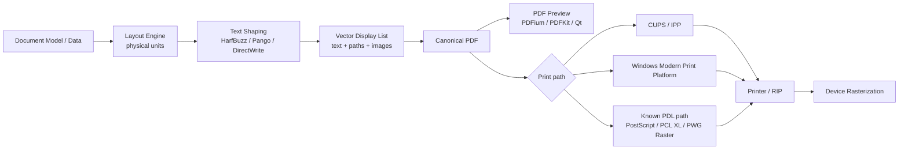
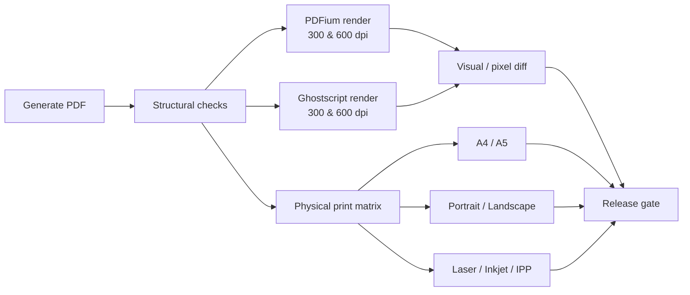
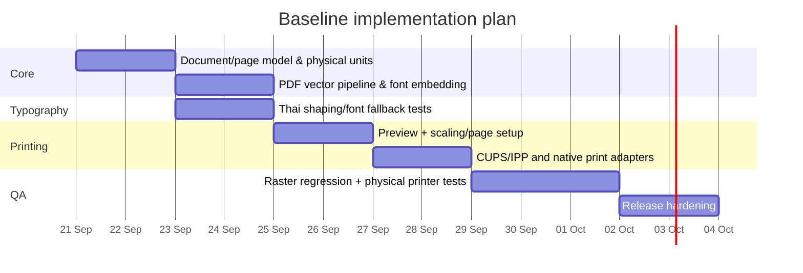

# รายงานเชิงลึก: Workflow การพิมพ์แอปพลิเคชันสมัยใหม่ในปี 2026 สำหรับ PDF และ Direct Print ที่คมชัดและเชื่อถือได้

## บทสรุปผู้บริหาร

ณ วันที่ 19 กันยายน 2026 แนวทางที่เหมาะสมที่สุดสำหรับแอปพลิเคชันทั่วไปที่ต้องผลิตเอกสารคุณภาพสูงคือ **PDF-first, vector-first, font-embedded**: ให้ระบบ layout สร้างหน้าเอกสารในหน่วยกายภาพที่แน่นอน จากนั้นเก็บข้อความ เส้น ตาราง และ shape เป็น vector/text objects ให้นานที่สุด และ rasterize เฉพาะภาพถ่ายหรือเอฟเฟ็กต์ที่จำเป็นจริง ๆ แนวทางนี้สอดคล้องกับบทบาทของ PDF ซึ่ง ISO กำหนดให้เป็นรูปแบบเอกสารที่ไม่ขึ้นกับ environment ที่ใช้แสดงผลหรือพิมพ์; ISO 32000-2:2020 สำหรับ PDF 2.0 ได้รับการทบทวนและยืนยันอีกครั้งในปี 2026 ว่ายังคงเป็นมาตรฐานปัจจุบัน. citeturn0search9

ข้อสรุปเชิงสถาปัตยกรรมที่สำคัญที่สุดคือ **อย่าคิดว่า “PDF มี DPI”**: PDF ที่ประกอบด้วยข้อความและ vector paths ไม่มี resolution ตายตัว ส่วนที่มี PPI/DPI จริง ๆ คือ raster images และขั้นตอนที่ PDF/PDL ถูก rasterize โดย renderer, driver หรือ RIP ไปสู่ device pixels. Cairo ระบุชัดว่า PDF backend เป็น multi-page vector backend และใช้พิกัดเป็น point โดย 1 point = 1/72 นิ้ว; Ghostscript แยก “high-level/vector devices” เช่น `pdfwrite`, `ps2write` ออกจาก raster devices อย่างชัดเจน. citeturn4view0turn16view0

สำหรับเอกสารสำนักงาน รายงาน ใบกำกับ ตาราง หรือแบบฟอร์มที่มีภาษาไทย ค่าตั้งต้นที่แนะนำคือ **ข้อความและเส้นเป็น vector; ฝังฟอนต์และ subset เมื่อสิทธิ์อนุญาต; ใช้ text shaping engine ที่รองรับภาษาไทย เช่น HarfBuzz ร่วมกับ Pango/Cairo หรือ DirectWrite; ภาพถ่ายประมาณ 300 ppi ที่ขนาดพิมพ์จริง; เส้นตารางทั่วไปประมาณ 0.25–0.5 pt แทน critical hairline 0 pt; พิมพ์ที่ Actual Size/100% เป็นค่าเริ่มต้น; และใช้ preview จาก artifact เดียวกับที่ส่งพิมพ์**. HarfBuzz แปลง Unicode text เป็น glyph sequence พร้อมตำแหน่งตาม direction/script/language ซึ่งเป็นสิ่งสำคัญสำหรับภาษาไทย ขณะที่ DirectWrite รองรับ international text layout รวมถึงภาษาไทย. citeturn5view0turn9view0

สำหรับงานโรงพิมพ์ที่ควบคุมสีจริงจัง ควรใช้ **PDF/X-4 เมื่อโรงพิมพ์กำหนดหรือรองรับ**, เก็บ transparency และ vector ไว้ และใช้ Output Intent/ICC profile ที่โรงพิมพ์ให้มา แทนการเดา CMYK profile เอง. Adobe ระบุ PDF/X-4 เป็นมาตรฐานสำหรับ print publishing ที่รองรับ transparency แบบ live; ICC กำหนดกลไก profile, profile connection space และ rendering intents สำหรับการแปลงสีระหว่างต้นทางกับอุปกรณ์ปลายทาง. citeturn0search16turn20view2turn20view1

ในระบบพิมพ์สมัยใหม่ **PDF ไม่ใช่ PDL เพียงชนิดเดียวที่ควรสนใจ**. IPP Everywhere ใช้โมเดล driverless printing และกำหนด PWG Raster เป็นหนึ่งใน format หลักที่อุปกรณ์ต้องรองรับ ขณะที่ PDF เป็น format ที่แนะนำแต่ไม่ได้หมายความว่า printer ทุกเครื่องรับ raw PDF โดยตรง. ฝั่ง Windows ปัจจุบัน Microsoft แนะนำ modern print platform โดยใช้ inbox IPP class driver และ Print Support Apps แทนการสร้าง vendor driver แบบเดิมสำหรับอุปกรณ์ใหม่. citeturn11view3turn7view3

ดังนั้น architecture ที่แนะนำสำหรับแอปใหม่คือ:



แนวคิดใน diagram คือให้ **layout และ content representation มี source of truth เดียว** และแยก “การสร้างเอกสาร” ออกจาก “การส่งไปยัง printer” เพราะ CUPS เองทำหน้าที่รับ page description แล้วเลือก filter/backend เพื่อแปลงเป็นรูปแบบที่ printer เข้าใจ ส่วน Windows spooler/print provider จัดการ queue และเส้นทางไปยังอุปกรณ์. citeturn11view2turn7view0

รายละเอียดที่ผู้ใช้ไม่ได้ระบุ ได้แก่ **รุ่น printer, native resolution, PDL ที่รองรับจริง, OS ที่ต้องรองรับ, ICC profile ของเครื่องพิมพ์/โรงพิมพ์, bleed, finishing, tray policy, requirement ด้าน PDF/A หรือ accessibility, ปริมาณหน้าต่องาน และข้อกำหนดเรื่องขนาดไฟล์** ดังนั้นค่าต่าง ๆ ในรายงานนี้ที่ระบุว่า “แนะนำ” เป็น engineering defaults สำหรับแอป desktop/server ทั่วไป ไม่ใช่ข้อกำหนดบังคับของเครื่องพิมพ์ทุกชนิด.

## สถาปัตยกรรมและมาตรฐานของ printing pipeline ปี 2026

**PDF ควรเป็น canonical document format สำหรับงานทั่วไป.** PDF 2.0 ถูกนิยามโดย ISO 32000-2 และมาตรฐานดังกล่าวได้รับการ confirm ในปี 2026; จุดแข็งของ PDF คือสามารถเก็บ text, font resources, paths, images, clipping, transparency, color spaces และ page geometry ในเอกสารที่ไม่ผูกกับ printer รุ่นใดรุ่นหนึ่ง. citeturn0search9

อย่างไรก็ดี “ใช้ PDF” ไม่ได้แปลว่าต้องสร้าง PDF 2.0 เสมอไป. สำหรับ interoperability กับ viewer, spooler และ printer ที่หลากหลาย ผมแนะนำให้แอปธุรกิจทั่วไปใช้ **PDF 1.7 เป็น compatibility baseline เมื่อ library รองรับ** และเลือก PDF 2.0 เมื่อ ecosystem ปลายทางได้รับการตรวจสอบแล้ว; สำหรับ prepress ให้ยึด PDF/X profile ที่โรงพิมพ์กำหนดเป็นหลัก. นี่เป็นข้อเสนอเชิง compatibility ไม่ใช่ข้อกำหนดของ ISO. Cairo รุ่นใหม่รองรับ PDF 1.4/1.5 และตั้งแต่ Cairo 1.18 รองรับ 1.6/1.7 ขณะที่ Qt `QPrinter` documentation ปัจจุบันระบุ PDF output เริ่มต้นของ Qt เป็น PDF 1.4 จึงไม่ควรสมมติว่า PDF generator ทุกตัวผลิต feature set เดียวกัน. citeturn4view0turn13view0

**PostScript ยังคงมีประโยชน์ใน legacy/enterprise/prepress workflows แต่ไม่ควรเป็น canonical default ของแอปใหม่** เมื่อเอกสารมี transparency หรือ feature ของ PDF สมัยใหม่. Ghostscript ระบุว่า `ps2write` เป็น high-level output device เช่นเดียวกับ `pdfwrite`; แต่หาก content มี PDF transparency ที่ PostScript แทนไม่ได้ ระบบจำเป็นต้อง flatten/rasterize ส่วนที่เกี่ยวข้องหรือทั้งหน้า ซึ่งทำให้สูญเสียข้อดีของ vector scalability. citeturn16view0

ลำดับ pipeline ที่ควรแยกให้ชัดมีสี่ชั้น:

**Document/Layout → Drawing representation → Page description → Device rasterization.** แอปควรทำ pagination, line breaking, table layout และ font shaping ก่อน จากนั้นสร้าง vector drawing operations แล้ว encode เป็น PDF หรือส่งเข้าสู่ native print API; printer driver/RIP จึงค่อยแปลงเป็น dots ตาม resolution และ marking engine ของอุปกรณ์. Ghostscript อธิบายกลไกนี้โดย interpreter สร้าง drawing primitives แล้ว output device อาจเก็บ primitives เป็น high-level page description หรือ render เป็น raster. citeturn16view0

ตารางเปรียบเทียบสามแนวทางหลัก:

| แนวทาง | PDF-first / vector-first | Render-to-bitmap ก่อนพิมพ์ | Direct PDL |
|---|---|---|---|
| Representation | Text + paths + images ใน PDF | หน้ากระดาษเป็น pixel array | PS/PCL XL/PWG Raster หรือ format ที่ printer รองรับ |
| ความคมของ text/เส้น | **ดีที่สุดโดยทั่วไป** เพราะคง vector ถึง RIP | ผูกกับ resolution ที่ rasterize | ดีมากถ้า PDL/driver เก็บ vector; PWG Raster เป็น raster |
| Scaling | Vector scale ได้ดี | ขยายแล้วเห็น pixel/blur | ขึ้นกับ PDL |
| ขนาด spool | โดยมากมีประสิทธิภาพสำหรับ text-heavy docs | สูงมากที่ 600/1200 dpi | แตกต่างตาม PDL/compression |
| Font portability | ฝัง font/subset ได้ | ไม่ต้องมี font หลัง rasterize แต่เสีย text semantics | ขึ้นกับ PDL/driver/font handling |
| Preview เทียบ print | **ทำให้เหมือนกันง่ายที่สุด** หาก preview/print ใช้ PDF เดียวกัน | เหมือนกันได้ แต่ preview อาจหนัก | ยากกว่าเพราะ device-specific |
| Color management | รองรับ ICC/PDF color spaces/output intent | สีถูก bake ตอน rasterize | ขึ้นกับ PDL/driver |
| Printer-specific trays/finishing | ส่งเป็น job attributes แยกจาก PDF | ส่งได้ผ่าน print system | มีความยืดหยุ่นสูงเมื่อควบคุม printer โดยตรง |
| เหมาะกับ | รายงาน ตาราง invoice แบบฟอร์ม เอกสารไทย prepress | thermal, fixed-resolution hardware, compatibility fallback | ระบบเฉพาะรุ่น printer / production |
| คำแนะนำปี 2026 | **Default** | ใช้เฉพาะเมื่อมีเหตุผล | ใช้เมื่อ capability ของปลายทางทราบแน่ชัด |

ข้อดีของ vector-first มีข้อยกเว้นสำคัญ: **การเลือก PDF backend ไม่รับประกันว่าทุก operation จะยังเป็น vector**. Skia ระบุว่า PDF backend อาจ “expand” operation บางประเภทด้วยการ rasterize vector graphics, ขยาย paths หรือเปลี่ยน text เป็น paths; image filters และ text-on-path บางกรณีทำให้ text-as-text หายไป. ดังนั้น QA ต้องตรวจ output จริง ไม่ใช่ดูเพียงว่า API เรียกว่า PDF. citeturn4view1

Ghostscript มีข้อควรระวังที่คล้ายกันเมื่อใช้เป็นตัว “rewrite PDF”: `pdfwrite` สร้าง PDF ใหม่จาก drawing primitives ไม่ใช่การคัดลอกโครงสร้าง input เดิม และ metadata/non-marking objects บางชนิดอาจเปลี่ยนหรือหายได้. ดังนั้นใช้ Ghostscript ได้ดีสำหรับ RIP, conversion, normalization และ QA แต่ไม่ควรถือว่า PDF→`pdfwrite`→PDF เป็น lossless structural round-trip. citeturn16view0

สำหรับ **IPP Everywhere**, การรับส่ง PDF ตรงไปยัง printer ต้องตรวจ `document-format-supported`; ห้ามสรุปว่า printer ที่เป็น IPP Everywhere ทุกตัวรับ PDF เพราะมาตรฐาน driverless ระบุ PWG Raster/JPEG ใน capability ขั้นพื้นฐาน และแนะนำ PDF แต่ PDF ไม่ใช่ capability ที่ควรเดาโดยไม่ query. citeturn11view3

## คุณภาพการเรนเดอร์: vector, DPI, ฟอนต์ สี เส้น และตาราง

หัวใจของ output ที่ “คม” คือการแยก **geometry resolution** ออกจาก **raster resolution**. Cairo และ PDFKit ใช้ point ซึ่งสัมพันธ์กับขนาดกายภาพ 72 pt/in; ดังนั้น font 10 pt, border 0.5 pt และตำแหน่ง table ไม่ควรเปลี่ยนเพียงเพราะ printer เป็น 300, 600 หรือ 1200 dpi. DPI มีผลเมื่อ raster image ถูกวางลงหน้า หรือเมื่อ renderer/RIP เปลี่ยน page description เป็น pixel grid. citeturn4view0turn17view2

สำหรับ raster assets ผมแนะนำ baseline ต่อไปนี้:

| เนื้อหา | ค่าตั้งต้นที่แนะนำที่ “ขนาดพิมพ์จริง” | เหตุผล |
|---|---:|---|
| Text / vector / table | **ไม่ rasterize** | ให้ RIP ใช้ device resolution |
| ภาพถ่ายสี/gray | ~300 ppi | baseline คุณภาพสูงที่สมเหตุผล |
| Screenshot/UI images | 200–300 ppi หรือมากกว่าตามรายละเอียด | อย่า upscale โดยไม่มีข้อมูลเพิ่ม |
| 1-bit line art / monochrome | 600–1200 ppi หากต้อง rasterize | ขอบ binary ต้องการ sampling สูงกว่า |
| Full-page bitmap fallback | 600 dpi สำหรับ text-heavy หาก memory/spool รับได้ | compromise ความคมกับขนาด |
| Preview บนจอ | render ตาม viewport/device scale | preview ไม่จำเป็นต้องมี print DPI |

ค่าประมาณ 300 ppi สำหรับ color/gray และ 1200 ppi สำหรับ monochrome line art สอดคล้องกับค่า `printer`/`prepress` ใน Ghostscript Distiller parameters ซึ่งกำหนด Color/Gray Image Resolution 300 และ Mono Image Resolution 1200; Ghostscript ยังตั้ง `EmbedAllFonts=true` และ `SubsetFonts=true` ใน workflow ดังกล่าว. citeturn16view0

ต้นทุนของการ raster ทั้งหน้าสูงมาก. A4 ประมาณ 8.27 × 11.69 นิ้ว: 300 dpi คือประมาณ 2,480 × 3,508 pixels; 600 dpi ประมาณ 4,961 × 7,016 pixels หรือราว 34.8 ล้าน pixels. RGB 8-bit แบบไม่บีบอัดที่ 600 dpi จึงใช้ราว **104 MB ต่อหน้า** ก่อน overhead/compression; 1200 dpi สูงกว่านั้นประมาณสี่เท่า. ตัวเลขเหล่านี้คำนวณจากขนาดกายภาพและ 72 pt/in ที่ backend PDF ใช้. citeturn4view0

**ฟอนต์ควรถูกฝังใน PDF โดยค่าเริ่มต้น**, โดยเฉพาะภาษาไทย และควร subset เฉพาะ glyph ที่ใช้เมื่อเอกสารเป็น final-output. Ghostscript ระบุว่าปกติ `pdfwrite` พยายามรักษา font เป็น font ใน output; `EmbedAllFonts` และ `SubsetFonts` รองรับ workflow นี้ และเตือนว่า `-dNoOutputFonts` ซึ่งเปลี่ยน text เป็น linework/bitmap ทำให้ output ใหญ่ขึ้น ช้าลง และโดยเฉพาะที่ resolution ต่ำสามารถ render text ได้ไม่สม่ำเสมอกว่า. citeturn16view0

อย่างไรก็ตาม **embedding/subsetting เป็นเรื่องสิทธิ์ของ font ด้วย**. OpenType `OS/2.fsType` กำหนด embedding licensing rights ตั้งแต่ Installable, Restricted, Preview & Print และ Editable; bit `No subsetting` ห้าม subset font และ specification ระบุว่า application ต้องไม่ฝัง font ที่ไม่มีสิทธิ์อนุญาต. ดังนั้น production pipeline ต้องตรวจ license/`fsType` ไม่ใช่บังคับ embed ทุกไฟล์โดยไม่ตรวจ. citeturn19view0

สำหรับเอกสารภาษาไทย อย่าทำ layout แบบ `Unicode code point → glyph` ตรง ๆ. HarfBuzz shaping API รับ Unicode buffer แล้วสร้าง glyphs พร้อมตำแหน่งโดยคำนึงถึง font, direction, script และ language; PangoCairo รวม text layout ของ Pango เข้ากับ Cairo และ DirectWrite รองรับ shaping/typography ของ international scripts รวมถึงภาษาไทย. citeturn5view0turn4view3turn9view0

นี่มีผลโดยตรงกับความถูกต้องของ **สระและวรรณยุกต์ไทย, mark positioning, ligatures, font fallback, line breaks และ pagination**. ดังนั้น font fallback ที่เกิดเฉพาะเครื่องลูกค้าถือเป็น bug ด้าน pagination ได้ แม้ข้อความจะยัง “อ่านได้”; ทางแก้คือให้ font selection และ shaping เป็น deterministic ก่อนสร้าง PDF และ embed font ที่ได้รับอนุญาต. ความจำเป็นของ shaping สำหรับ complex script สนับสนุนโดย HarfBuzz/DirectWrite; ข้อสรุปด้าน pagination เป็นผลเชิงวิศวกรรมจากการเปลี่ยน glyph metrics. citeturn5view0turn9view0

**Hinting และ antialiasing ต้องมองว่าเป็นขั้นตอน rasterization ไม่ใช่ page-layout setting.** FreeType อธิบาย hinting/grid-fitting และ grayscale coverage ในกระบวนการ raster glyph ส่วน DirectWrite แยก rendering modes เช่น grayscale, aliased และ ClearType; ดังนั้นอย่า render text ด้วย screen-oriented LCD/subpixel antialiasing แล้วนำ bitmap นั้นไปพิมพ์. ควรคง glyph/font/vector ไว้จนถึง printer renderer หรือหากต้อง rasterize ให้ใช้ print-oriented grayscale/monochrome rendering แทน screen subpixel optimization. citeturn5view1turn9view0

PDFium สะท้อน distinction นี้โดยตรง: มี flag `FPDF_LCD_TEXT` สำหรับ text rendering ที่ optimize สำหรับ LCD และแยก `FPDF_PRINTING` สำหรับ rendering เพื่อการพิมพ์ รวมถึง flags ที่ควบคุม smoothing ของ text/images/paths. citeturn17view1

**สีควรมี ownership เพียงจุดเดียว.** สำหรับ office/general-purpose workflow ผมแนะนำให้ content RGB มี source profile ที่ชัดเจน เช่น sRGB และปล่อย OS/driver/printer ทำ output conversion เมื่อไม่มี printer-specific profile; สำหรับ controlled prepress ให้ใช้ profile/output intent ที่โรงพิมพ์ให้และหลีกเลี่ยงการ convert ซ้ำหลายรอบ. ICC architecture ใช้ Profile Connection Space เพื่อเชื่อม source และ destination profiles และกำหนด output-device profile class โดยเฉพาะ. citeturn20view2turn20view0

การเลือก rendering intent ไม่ควร hard-code แบบเดียวกับทุก content. ICC ระบุว่า **Perceptual** เหมาะโดยทั่วไปกับ natural/pictorial images, **media-relative colorimetric** เหมาะเมื่ออยาก map source-media white ไปยัง destination-media white และ **ICC-absolute colorimetric** เหมาะกับ proofing ที่ต้องจำลองสีของอุปกรณ์หนึ่งบนอีกอุปกรณ์หนึ่ง. citeturn20view1turn21view0

สำหรับเส้น ตาราง และ shape ปัญหาที่พบบ่อยที่สุดคือ **hairline**. PDF สามารถมี zero-width hairline ที่ renderer แสดงเป็นเส้นบางที่สุดที่อุปกรณ์ทำได้ แต่การใช้มันเป็น border สำคัญทำให้ความหนาทางกายภาพขึ้นกับ renderer/resolution และการ scale. ดังนั้นสำหรับ business tables ผมแนะนำ inner grid ประมาณ **0.25–0.4 pt** และ border สำคัญ **0.5 pt หรือมากกว่า** แทน 0 pt; exact styling เป็น design policy ไม่ใช่มาตรฐาน PDF. หลักการ line geometry อยู่ภายใต้ PDF graphics model ของ ISO 32000. citeturn0search9

เพื่อเห็น scale: 1 dot ที่ 300 dpi ≈ 0.24 pt, ที่ 600 dpi ≈ 0.12 pt และที่ 1200 dpi ≈ 0.06 pt. ดังนั้น border 0.25 pt อยู่ใกล้หนึ่ง device dot ที่ 300 dpi แต่ประมาณสอง dots ที่ 600 dpi; นี่อธิบายว่าทำไม border บางมากจึงเปลี่ยน appearance ระหว่าง printers ได้ แม้ PDF เดียวกัน.

สำหรับ table renderer ให้ **วาด shared border ครั้งเดียว** ไม่ใช่ให้ cell ซ้ายและขวาต่างคนต่าง stroke เส้นเดียวกัน เพราะอาจเกิดเส้นหนาเป็นสองเท่า; ใช้ fills สำหรับ backgrounds แล้ววาด grid เป็น coherent paths; อย่า screenshot/rasterize ตารางทั้งก้อนเพียงเพื่อให้ layout ง่ายขึ้น. ข้อนี้เป็น engineering recommendation เพื่อคง vector geometry และหลีกเลี่ยงความแตกต่างจาก repeated strokes ตาม graphics pipeline ที่ Cairo/Ghostscript ใช้. citeturn4view0turn16view0

## ขนาดกระดาษ การจัดหน้า scaling preview และเส้นทางสู่ printer

สำหรับ page geometry ควรใช้ **physical page size เป็น source of truth**. จาก A4 = 210 × 297 mm:

| กระดาษ | Portrait โดยประมาณใน PDF points | Landscape |
|---|---:|---:|
| A4 | 595.276 × 841.890 pt | 841.890 × 595.276 pt |
| A5 | 419.528 × 595.276 pt | 595.276 × 419.528 pt |
| Letter | 612 × 792 pt | 792 × 612 pt |
| Legal | 612 × 1008 pt | 1008 × 612 pt |

การแปลงนี้ใช้ 72 pt/in ตาม coordinate convention ที่ Cairo และ PDFKit ระบุ; PDFKit ยังอนุญาต `size` เป็น `[width,height]` ใน PDF points และ `layout` เป็น `portrait`/`landscape`. citeturn4view0turn17view2

ควร **ทำ landscape ด้วย page layout/page dimensions ไม่ใช่หมุน bitmap หลัง layout เสร็จ**. Mixed-size document ควรกำหนด size ให้แต่ละหน้าโดยตรง; Cairo มี `cairo_pdf_surface_set_size()` เพื่อเปลี่ยนขนาด current/subsequent page ก่อนเริ่มวาด และ Qt มี `QPageSize`/`QPageLayout` ผ่าน `QPrinter`. citeturn4view0turn13view0

Pagination ต้องทำบน **content rectangle หลังหัก margins/header/footer** และควรใช้ metrics จาก font/shaping engine เดียวกับ output. การคำนวณ pagination ด้วย screen font metrics แล้วพิมพ์ด้วยอีก font stack เป็นแหล่งของ page break drift; DirectWrite มี resolution-independent text layout และ PangoCairo ให้ layout/render ผ่าน stack เดียวกันได้. citeturn9view0turn4view3

สำหรับ direct printing ต้องแยก **physical page** ออกจาก **printable/imageable area**. PDF สามารถมี content จนสุด page แต่ printer ที่ไม่ใช่ borderless อาจพิมพ์ไม่ถึงขอบ; ค่า hard margins เป็น capability ของ printer/driver และไม่ได้ระบุในคำถามนี้. ผมจึงแนะนำให้ query imageable area จาก native print API และใช้ safe margin policy; หากไม่ทราบเครื่องพิมพ์จริง ค่า margin เช่น 10 mm อาจใช้เป็น conservative application default ได้ แต่ไม่ใช่ค่ามาตรฐานสากล. Qt ให้เลือก `setFullPage()` และ page layout ตาม printer/device. citeturn13view0

**Actual Size/100% ควรเป็นค่าเริ่มต้นสำหรับเอกสารที่มี page size ถูกต้อง**. CUPS ระบุว่าโดยปกติ scaling อ้างอิงขนาดที่ระบุอยู่ในไฟล์ และมี `fit-to-page` เป็น option ต่างหาก; ถ้า metadata/page size ไม่ถูกต้อง fit-to-page อาจ scale ผิด. ดังนั้นแอปควรแสดง scale factor ใน preview และไม่เปิด “Fit” แบบเงียบ ๆ. citeturn11view0

แนวทาง scaling ที่แนะนำคือ:

| สถานการณ์ | Policy |
|---|---|
| A4 PDF → A4 paper | 100% / Actual Size |
| A5 PDF → A5 paper | 100% |
| A5 → A4 เพื่ออ่านง่าย | Center ที่ 100% เว้นแต่ผู้ใช้เลือก enlarge |
| A4 → A5 | ต้องแจ้ง scale down อย่างชัดเจน |
| Page ใหญ่เกิน printable area | เสนอ “shrink to printable area” โดยแสดงเปอร์เซ็นต์ |
| Print-ready/prepress | ห้าม auto-fit เว้น workflow กำหนด |
| Poster/N-up/booklet | เป็น pagination/imposition feature แยกต่างหาก |

CUPS รองรับ options สำหรับ A4, orientation, duplex, page ranges, N-up และ fit-to-page ในระดับ print job; นั่นเป็นเหตุผลว่าทำไมควรแยก document geometry ออกจาก printer job options. citeturn11view0

**Print Preview ควร render จาก artifact เดียวกับที่จะ print**. หาก canonical output คือ PDF ควร preview PDF นั้นด้วย PDFium/PDFKit/Qt PDF renderer แทนการ preview จาก widget tree แล้ว generate PDF ด้วย code path อีกชุดหนึ่ง. PDFium `FPDF_RenderPageBitmap()` render หน้า PDF ลง device-independent bitmap ตาม pixel dimensions ที่ระบุ และ Qt มี `QPrintPreviewDialog` สำหรับ preview print layout. citeturn17view0turn12search15

ความแตกต่างระหว่าง **native PDF export** กับ **Print to PDF** สำคัญมาก:

| Native PDF export | Print-to-PDF virtual printer |
|---|---|
| App ควบคุม PDF objects/fonts/page boxes โดยตรง | App วาดผ่าน print API แล้ว virtual driver แปลงอีกชั้น |
| เหมาะเป็น canonical artifact | เหมาะเป็น convenience/output compatibility |
| ลดโอกาส scaling ซ้ำ | อาจได้รับ driver margins/print settings |
| ตรวจ embedding/color ได้ง่ายกว่า | ผลขึ้นกับ virtual driver |
| ทำ preview = final PDF ได้ตรงกว่า | Preview ของ app อาจไม่ใช่ PDF ที่ driver สร้าง |

ดังนั้นเมื่อแอป “เป็นเจ้าของ” document model ผมแนะนำ **native PDF generation ก่อน virtual Print-to-PDF**; direct print ควรพยายามส่ง canonical PDF หรือ render จาก display list เดียวกัน เพื่อไม่ให้มี layout engine สองชุด.

เส้นทาง OS ปัจจุบันแตกต่างกัน. Qt ระบุว่า `QPrinter::NativeFormat` บน Windows/macOS ใช้ built-in printer facilities/drivers ส่วนบน X11/Unix ผ่าน CUPS จะส่ง PDF output ไปยัง print system. CUPS รับ job แล้วทำ filter/backend conversion ตาม printer configuration. citeturn13view0turn11view2

บน Windows ปี 2026 ไม่ควรออกแบบผลิตภัณฑ์ใหม่โดยตั้งสมมติฐานว่า vendor-specific GDI/v3/v4 driver จะเป็นอนาคตระยะยาว. Microsoft documentation ปัจจุบันแนะนำ **IPP inbox class driver + Print Support Apps** และเรียก modern print platform ว่า preferred direction สำหรับ printer device development; อย่างไรก็ดี GDI/print DC และ v4/XPSDrv ยังพบได้ในแอป desktop/legacy ecosystem. citeturn7view3turn7view0

## เครื่องมือและไลบรารีที่ควรเลือก

**Cairo** เหมาะมากเมื่อแอปมี drawing model 2D และต้องการ PDF vector โดยตรง. PDF surface เป็น multi-page vector backend, ใช้ point เป็นหน่วย, เปลี่ยน page size รายหน้าได้ และตั้ง PDF version constraints ได้. เหมาะกับ reports, charts, forms และการจับคู่กับ Pango. citeturn4view0

**Pango + Cairo** เป็น stack ที่เหมาะโดยเฉพาะสำหรับ multilingual desktop/server rendering: Pango ทำ text layout และ PangoCairo เชื่อม layout นั้นไปยัง Cairo surfaces; documentation ปัจจุบันที่ดึงมาเป็น PangoCairo 1.58.2 และมี APIs สำหรับ layout/context/font options/resolution. citeturn4view3

**HarfBuzz** เป็น shaping engine ไม่ใช่ pagination engine และไม่ใช่ PDF writer. บทบาทคือเปลี่ยน Unicode text เป็น positioned glyphs ที่ถูกต้องตาม script/language/direction. ถ้า architecture ใช้ HarfBuzz โดยตรง แอปยังต้องมี line-breaking, paragraph layout, font fallback และ PDF text mapping ของตัวเองหรือใช้ layer เช่น Pango. citeturn5view0

**Skia** เหมาะกับแอปที่ต้องการ graphics engine เดียวสำหรับ screen และ PDF แต่ต้อง audit PDF output เพราะ operation บางชนิดถูก expand/rasterize หรือเปลี่ยน text เป็น path. การใช้ Skia จึงให้ code reuse สูง แต่ไม่ควรเท่ากับสมมติว่า “ทุกอย่างเป็น vector โดยอัตโนมัติ”. citeturn4view1

**PDFKit (Node.js)** เป็น PDF generator ที่ใช้ง่ายสำหรับ server/business documents; documentation รองรับ predefined/custom page sizes, portrait/landscape, points/physical units, margins, buffered pages และ custom registered fonts. สำหรับภาษาไทย ควรทดสอบ shaping/fallback ของ version ที่นำไปใช้จริง; หาก behavior ไม่ผ่าน Thai test corpus ให้ใช้ shaping stack ที่ทราบแน่นอนแทน. citeturn17view2turn17view3

**Apple PDFKit** เป็น framework ฝั่ง Apple สำหรับการทำงานกับ PDF และเหมาะกับ view/document integration บน macOS/iOS; เนื่องจากรายละเอียด requirement ของ macOS/iOS version ในโจทย์ **ไม่ได้ระบุ** จึงไม่ควรผูก architecture กลางกับ Apple-only API หากต้องรองรับหลาย OS. Apple ยังเผยแพร่ PDFKit เป็น framework ใน developer documentation ปัจจุบัน. citeturn19view2turn19view3

**PDFium** เหมาะกับ preview, validation rendering และ print rasterization มากกว่าการเป็น high-level document generator. API ปัจจุบันมีทั้งการ render ลง bitmap, render ผ่าน transform matrix และบน Windows render ไปยัง device context; มี `FPDF_PRINTING` แยกจาก LCD-optimized rendering. citeturn17view0turn17view1

**Ghostscript** เหมาะเป็น interpreter/RIP/converter/preflight helper: `pdfwrite`, `ps2write`, `pxlmono`, `pxlcolor` เป็น high-level outputs และ raster devices ใช้สำหรับสร้าง reference images เพื่อ QA ได้. ต้องจำไว้ว่า conversion สร้าง page description ใหม่ และ feature ที่ target PDL แทนไม่ได้อาจถูก rasterize. citeturn16view0

**Qt Printing** เหมาะกับ cross-platform desktop app ที่ต้องการ API เดียวสำหรับ native printer และ PDF. `QPrinter` เป็น paint device, มี `NativeFormat` และ `PdfFormat`, ตั้ง page layout/resolution/full-page/font embedding ได้; `HighResolution` ใช้ printer resolution บน Windows และ documentation ระบุ PDF driver ที่ 1200 dpi สำหรับ coordinate resolution. ข้อหลังไม่ควรตีความว่า “PDF ถูก raster ที่ 1200 dpi” เพราะ text/vector ยังเป็น resolution-independent objects. citeturn13view0

**Windows GDI/DirectWrite** ควรแยกบทบาท: GDI/print DC เป็น legacy/native graphics-print path ที่ยังมี deployment จำนวนมาก ส่วน DirectWrite เหมาะกับ text shaping/layout และ resolution-independent typography. สำหรับแอปใหม่บน Windows ให้คิดในทิศทาง modern print platform/IPP สำหรับ device integration มากกว่าการสร้าง driver เฉพาะใหม่. citeturn9view0turn7view3

**CUPS** เป็น print system ไม่ใช่ renderer เพียงตัวเดียว: รับ job, สร้าง queue และเลือก filters/backends เพื่อแปลง page description ให้ printer เข้าใจ; CLI รองรับ PDF/PostScript/images และกำหนด media, orientation, duplex, page ranges, N-up และ fitting ได้. citeturn11view2turn11view0

ตารางเลือก stack โดยย่อ:

| Requirement | Stack ที่เหมาะ |
|---|---|
| Linux/server PDF + ภาษาไทย | **Pango + Cairo + HarfBuzz** |
| Cross-platform C++ desktop | **Qt + QPainter/QPrinter**, หรือ Skia + PDF pipeline |
| Node.js report generation | PDFKit โดยต้องทดสอบ Thai shaping/output |
| Fast PDF preview | **PDFium** |
| PDF/PS/PCL conversion และ QA | **Ghostscript** |
| macOS/iOS native PDF UI | Apple PDFKit |
| Windows advanced text | **DirectWrite** |
| Linux/macOS/network spool | **CUPS/IPP** |
| Driverless printer integration | **IPP Everywhere / PWG Raster/PDF เมื่อ capability รองรับ** |

## Recommended defaults ปัญหาที่พบบ่อย และตัวอย่าง implementation

สำหรับแอปเอกสารทั่วไป ผมแนะนำ configuration baseline นี้:

| หัวข้อ | Default ที่แนะนำ |
|---|---|
| Canonical output | PDF |
| PDF compatibility | PDF 1.7 สำหรับ general interoperability; PDF/X-4 ตามโรงพิมพ์; PDF 2.0 เมื่อปลายทางยืนยัน |
| Coordinates | points/mm/inches ไม่ใช่ device pixels |
| Text | live text + embedded font |
| Thai | HarfBuzz/Pango/DirectWrite shaping |
| Font subset | เปิดสำหรับ final docs เมื่อ license อนุญาต |
| Raster images | ~300 ppi ที่ final size |
| Mono line art | 600–1200 ppi หากจำเป็นต้อง raster |
| Tables | vector fills + paths |
| Critical thin borders | 0.25–0.5 pt; หลีกเลี่ยง zero-width hairline |
| Print scaling | Actual Size / 100% |
| Orientation | page layout จริง ไม่หมุน final bitmap |
| Preview | render final PDF |
| Color office docs | defined RGB/sRGB source; avoid double conversion |
| Controlled prepress | PDF/X-4 + ICC/output intent ที่โรงพิมพ์ระบุ |
| Direct printer | query capability ก่อนเลือก PDF/PS/PWG Raster |
| Windows ใหม่ | modern print platform / IPP path |
| Linux/macOS/network | CUPS/IPP |
| QA rasterization | อย่างน้อย 300 และ 600 dpi |

Baseline ด้านภาพและ font ข้างต้นสอดคล้องกับ Ghostscript printer/prepress parameters และ font handling ส่วนข้อแนะนำ PDF version/hairline/scaling เป็น engineering policy ที่ควร validate กับ printer estate จริง. citeturn16view0turn0search9

**อาการ “ข้อความเบลอ”** มักเกิดจาก text ถูก rasterize ก่อนถึง printer หรือใช้ screen bitmap ใน print pipeline. วิธีตรวจคือ zoom PDF มาก ๆ: หาก glyph แตกเป็น pixel แสดงว่าถูก raster ก่อนเวลา; หากยังคมเป็น path/text ให้ตรวจ downstream renderer/driver. PDFium แยก LCD-text optimization จาก print rendering และ Ghostscript เตือนว่าการแปลง font เป็น vector/bitmap อย่างไม่จำเป็นเปลี่ยน rendering behavior. citeturn17view1turn16view0

**อาการ “เส้นตารางบางหาย/หนาไม่เท่ากัน”** ให้ตรวจ 0-width hairlines, shared edges ที่ถูกวาดสองครั้ง, scale factor ที่ไม่ใช่ 100%, non-uniform transforms และ raster target ที่ resolution ต่ำ. วิธีแก้หลักคือใช้ physical stroke widths, render border ครั้งเดียว และทดสอบที่ 300/600 dpi รวมถึงเครื่องจริง.

**อาการ “A4 ถูกย่อเหลือ 96–97%”** มักเกี่ยวกับ printable margins หรือ automatic fit. ให้ตรวจว่าหน้า PDF เป็น A4 จริง, printer media เป็น A4 จริง และ print dialog ไม่ได้เปิด Fit/Shrink; CUPS แยก `fit-to-page` ออกจาก default page sizing อย่างชัดเจน. citeturn11view0

**อาการ “ภาษาไทยวรรณยุกต์เพี้ยน”** ให้ตรวจสามชั้นตามลำดับ: shaping → font fallback → font embedding. อย่าแก้ด้วยการ convert text ทั้งหมดเป็น bitmap; ใช้ HarfBuzz/Pango/DirectWrite และ embed font ที่อนุญาตให้ embed แทน. citeturn5view0turn4view3turn19view0

**อาการ “PDF ดูคมแต่ direct print เบลอ”** บ่งชี้ว่าความแตกต่างอยู่หลัง canonical document stage เช่น native driver, print DC, spool conversion หรือ printer-side rasterization. แนวทางวิเคราะห์คือพิมพ์ PDF เดียวกันผ่านสอง path, capture spool/PDL ถ้าระบบอนุญาต และเปรียบเทียบกับ raster reference จาก PDFium/Ghostscript. โครงสร้าง spooler/print providers ของ Windows และ CUPS filtering ทำให้ downstream conversion เป็นขั้นแยกจาก app layout จริง. citeturn7view0turn11view2

**อาการ “PDF ที่ผ่าน Ghostscript แล้วบางอย่างเปลี่ยน”** ไม่ควรถูกมองว่าเป็นความผิดปกติโดยอัตโนมัติ เพราะ `pdfwrite` reconstructs PDF จาก marking primitives และไม่ใช่ byte/structure-preserving editor. หากต้องการ merge/split โดยรักษา object structure ให้ใช้ PDF manipulation library ที่ทำ structural editing แทน. citeturn16view0

ตัวอย่าง **Cairo + Pango** สำหรับ PDF A4 ที่เหมาะกับข้อความไทย โดยย่อ:

```c
// Pseudocode / C-like

const double A4_W = 595.2756;   // pt
const double A4_H = 841.8898;   // pt

cairo_surface_t *surface =
    cairo_pdf_surface_create("report.pdf", A4_W, A4_H);

cairo_t *cr = cairo_create(surface);

// Pango performs text layout/shaping.
// Select a Thai-capable embeddable font in production.
PangoLayout *layout = pango_cairo_create_layout(cr);
pango_layout_set_text(
    layout,
    "รายงานประจำเดือน – ทดสอบสระและวรรณยุกต์ไทย",
    -1
);

PangoFontDescription *font =
    pango_font_description_from_string("Noto Sans Thai 10");
pango_layout_set_font_description(layout, font);

cairo_move_to(cr, 36, 40);
pango_cairo_show_layout(cr, layout);

// Table border: use explicit physical width, not hairline 0.
cairo_set_line_width(cr, 0.5);

cairo_rectangle(cr, 36, 90, 523, 180);
cairo_stroke(cr);

// Add rows using one coherent grid path,
// rather than drawing both sides of every cell independently.

cairo_show_page(cr);
cairo_destroy(cr);
cairo_surface_destroy(surface);
```

Cairo PDF surface ใช้ points และเป็น vector backend ส่วน PangoCairo มีไว้สำหรับนำ Pango layout ไปวาดผ่าน Cairo จึงเหมาะกับแนวทางนี้. citeturn4view0turn4view3

ตัวอย่าง **Node.js PDFKit** สำหรับ report ที่กำหนดกระดาษชัดเจน:

```js
const fs = require("node:fs");
const PDFDocument = require("pdfkit");

const doc = new PDFDocument({
  size: "A4",
  layout: "portrait",
  margin: 36,
  bufferPages: true,
});

doc.pipe(fs.createWriteStream("report.pdf"));

// Use a font whose embedding licence permits this use.
doc.registerFont("Thai", "./fonts/NotoSansThai-Regular.ttf");

doc.font("Thai")
   .fontSize(10)
   .text("รายงานสำหรับการพิมพ์ A4", 36, 36);

doc.save()
   .lineWidth(0.5)
   .rect(36, 90, 523, 180)
   .stroke()
   .restore();

doc.end();
```

PDFKit documentation ระบุ A4/custom size, portrait/landscape, points และ custom font registration; อย่างไรก็ตาม **Thai shaping behavior ของ PDFKit version ที่ deployment ใช้ไม่ได้ระบุในโจทย์นี้** จึงต้องมี regression tests จริงก่อนเลือกเป็น production stack สำหรับเอกสารไทยจำนวนมาก. citeturn17view2turn17view3

ตัวอย่างส่ง canonical PDF ผ่าน **CUPS**:

```bash
lp \
  -d OfficePrinter \
  -o media=A4 \
  -o sides=two-sided-long-edge \
  report.pdf
```

อย่าใส่ `fit-to-page` หากต้องการพิมพ์ A4 ที่ 100%; CUPS รองรับ PDF โดยตรงใน client workflow และมี media/duplex/fitting เป็น job options. citeturn11view0turn11view2

สำหรับ IPP โดยตรง ควรทำในรูปแบบ capability-driven pseudocode:

```text
caps = IPP.GetPrinterAttributes(printer)

format =
    if "application/pdf" in caps.document-format-supported:
        "application/pdf"
    else if "image/pwg-raster" in caps.document-format-supported:
        convert_pdf_to_pwg_raster_at_supported_resolution()
    else:
        use_OS_print_pipeline()

job = {
    media: "iso_a4_210x297mm",
    sides: "two-sided-long-edge",
    orientation: derived_from_document,
    document_format: format
}

IPP.PrintJob(printer, job, document)
```

เหตุผลที่ต้อง query format คือ IPP Everywhere ไม่ได้รับประกัน raw-PDF support ใน printer ทุกเครื่อง แม้ PDF จะเป็น format ที่เหมาะและแพร่หลายมาก. citeturn11view3

ตัวอย่าง **Qt direct printing**:

```cpp
QPrinter printer(QPrinter::HighResolution);
printer.setOutputFormat(QPrinter::NativeFormat);

QPageLayout layout(
    QPageSize(QPageSize::A4),
    QPageLayout::Portrait,
    QMarginsF(10, 10, 10, 10),
    QPageLayout::Millimeter
);

printer.setPageLayout(layout);

QPrintDialog dialog(&printer);
if (dialog.exec() == QDialog::Accepted) {
    QPainter painter(&printer);

    // Important: render the same document/display-list
    // used for PDF generation, in physical coordinates.
    drawDocument(painter, printer.pageLayout());

    painter.end();
}
```

Qt ให้ `QPrinter` ทำงานทั้ง native printing และ PDF และมี `QPrintPreviewDialog`; การตั้ง margin 10 mm ในตัวอย่างเป็น application policy ไม่ใช่ printer standard และ production code ควร reconcile กับ imageable area ของ device. citeturn13view0turn12search15

## การทดสอบ QA checklist และแผน implementation

ระบบที่ “เปิด PDF แล้วดูดีบนเครื่อง developer” ยังไม่ผ่าน print QA. Renderer ต่างกันสามารถมี behavior ต่างกันได้ โดยเฉพาะ transparency, clipping, fonts, transforms และ raster fallback; Skia เองบันทึก limitation ที่บาง operation ถูก rasterize/expand ขณะที่ PDFium และ Ghostscript มี rendering paths ต่างกัน จึงควรใช้มากกว่าหนึ่ง renderer ใน regression suite. citeturn4view1turn17view0turn16view0

ชุด **developer checklist** ที่ผมแนะนำมีสาระสำคัญดังนี้:

- ตรวจ page size/orientation ของทุกหน้าเป็น physical dimensions และทดสอบอย่างน้อย A4, A5, portrait, landscape และ mixed-size หาก product รองรับ; Cairo/Qt รองรับการกำหนด page geometry รายหน้า. citeturn4view0turn13view0
- ตรวจว่า text สำคัญยังเป็น text/font หรือ vector ที่ตั้งใจ ไม่ใช่ bitmap โดยไม่รู้ตัว; ฝัง font และตรวจ `fsType` ก่อน subset/embed. citeturn16view0turn19view0
- มี Thai corpus ที่รวม ก ข ฃ, สระหน้า/หลัง/บน/ล่าง, วรรณยุกต์, ตัวเลขไทย, Latin+Thai ผสม, bold/italic/fallback และข้อความยาวข้ามหน้า เพื่อจับ shaping/pagination regressions. HarfBuzz/DirectWrite เป็น reference architecture สำหรับ shaping. citeturn5view0turn9view0
- ตรวจ effective PPI ของ image ที่ **final placement size**, ไม่ใช่ดูเพียง pixel dimensions ของต้นฉบับ; สำหรับ normal color images ใช้ประมาณ 300 ppi เป็น baseline และไม่ downsample โดยไม่จำเป็นสำหรับ high-quality output. Ghostscript printer/prepress profiles ใช้ 300 dpi color/gray และ 1200 dpi mono เป็น reference ที่เหมาะ. citeturn16view0
- ตรวจ zero-width/critical hairlines, duplicate grid strokes, clipping และ transforms; render test page ที่มีเส้น 0.1, 0.2, 0.25, 0.3, 0.5 และ 1 pt เพื่อเห็น threshold ของ printer จริง.
- ทดสอบ raster reference อย่างน้อย 300 และ 600 dpi และทำ pixel-diff/visual-diff บริเวณ text, thin lines, transforms และ transparency โดยใช้ PDFium และ/หรือ Ghostscript. citeturn17view0turn16view0
- ทดสอบ Actual Size กับ Fit-to-page แยกกัน และตรวจว่า UI ไม่ silently scale เอกสาร; CUPS มี fitting เป็น explicit job option. citeturn11view0
- ทดสอบ direct print และ PDF→viewer→print จาก PDF เดียวกัน เพื่อ isolate ปัญหาระหว่าง app renderer กับ spooler/driver.
- query printer capabilities ก่อนเลือก raw PDL/PDF; โดยเฉพาะ IPP ต้องดู `document-format-supported`, media, duplex และ resolution แทนการ hard-code. citeturn11view3
- สำหรับ Windows ใหม่ ให้ทดสอบกับ IPP class-driver path อย่างน้อยหนึ่งเครื่อง ไม่ใช่เฉพาะ proprietary legacy driver เพราะ Microsoft กำลังชี้ platform ไปในทิศทาง IPP + Print Support Apps. citeturn7view3
- หาก color critical ให้มี ICC/output-intent tests และ physical proof; rendering intent ต้องเลือกตาม content/use case ไม่ใช่ตั้งค่าคงที่โดยไม่วิเคราะห์. citeturn20view1turn21view0

**Test page หนึ่งหน้าที่มีประโยชน์มาก** ควรรวมภาษาไทยและอังกฤษที่ 6/7/8/9/10/12/18 pt, regular/bold; ตารางที่มีเส้นหลายความหนา; shapes ที่ translate/rotate/scale; grayscale ramp; RGB photographs; color patches; transparency; clipping; รูป 150/300/600 ppi; และ footer ที่อยู่ใกล้ imageable boundary. จากนั้นพิมพ์ test sheet เดียวกันผ่าน PDF-first, direct native และ raster fallback เพื่อให้ความต่างเห็นได้ทันที.

สำหรับ automated QA ผมแนะนำ pipeline:



PDFium ให้ควบคุม bitmap dimensions/transform สำหรับ reference rendering ส่วน Ghostscript ทำหน้าที่ interpreter/rasterizer อิสระอีก implementation หนึ่ง จึงช่วยจับความผิดพลาดที่ renderer เดียวอาจไม่เปิดเผย. citeturn17view0turn16view0

**Recommended settings แยกตาม use case:**

| Use case | Recommended pipeline | ค่าเด่น |
|---|---|---|
| Invoice / receipt A4/A5 | PDF-first | embedded/subset font, vector table, 0.25–0.5 pt grid, 100% |
| รายงานภาษาไทยจำนวนมาก | Pango/Cairo หรือ stack ที่ใช้ HarfBuzz | deterministic Thai shaping + embedded fonts |
| Desktop cross-platform | Qt + canonical PDF | preview PDF, NativeFormat สำหรับ direct |
| Web/server report service | native PDF generator | 300 ppi images; avoid HTML screenshot-as-PDF หากต้องการความคมสูง |
| Photo-heavy brochure office | PDF vector + 300 ppi images | defined RGB source profile |
| Commercial print | PDF/X-4 ตาม printer spec | ICC output intent, no unnecessary flattening/downsample |
| Legacy PostScript printer | PDF canonical → PS ที่ print boundary | ยอมรับว่าบาง transparency อาจ rasterize |
| IPP Everywhere | PDF ถ้า advertised; PWG Raster fallback | capability-driven |
| Thermal/fixed-resolution | raster/PDL ตาม device | render ที่ supported device resolution |
| Archival/share + print | canonical PDF | ไม่พึ่ง printer-resident fonts |

PDF/X-4/live transparency guidance มาจาก Adobe print-publishing documentation; IPP/PWG Raster policy มาจาก PWG/OpenPrinting; PostScript transparency fallback สอดคล้องกับ Ghostscript. citeturn0search16turn11view3turn16view0

สำหรับ **implementation timeline แบบสั้น** เนื่องจากขนาดทีม, codebase และ printer estate **ไม่ได้ระบุ** ผมตั้งสมมติฐานว่าเป็นทีมเล็กที่มีแอปหนึ่งตัวและ printer families หลัก 1–2 กลุ่ม. ระยะจริงอาจยาวกว่านี้มากหากมี prepress, production printers หรือหลาย OS.



ในทางปฏิบัติ baseline ประมาณ **สองถึงสามสัปดาห์ทำการ** เหมาะสำหรับการสร้างและ harden pipeline ที่มี canonical PDF, Thai shaping, preview, A4/A5 portrait/landscape, direct print และ regression tests; นี่เป็น estimate เชิง implementation ไม่ใช่ข้อมูลจากมาตรฐาน.

ข้อสรุปสุดท้ายคือ: **คุณภาพงานพิมพ์สูงไม่ได้มาจากการตั้ง DPI ให้สูงที่สุด แต่เกิดจากการหลีกเลี่ยง rasterization ที่ไม่จำเป็น, รักษาหน่วยกายภาพและ geometry อย่างถูกต้อง, shape/embed font อย่าง deterministic, จำกัด color conversion ให้มี owner ชัดเจน, หลีกเลี่ยง critical hairlines, ไม่ auto-scale โดยไม่แจ้งผู้ใช้ และส่ง artifact เดียวกันผ่าน preview กับ print pipeline ให้ไกลที่สุด**. สถาปัตยกรรม PDF-first ทำให้เงื่อนไขเหล่านี้ควบคุมและทดสอบได้ง่ายที่สุด ขณะที่ CUPS/IPP และ Windows modern print platform สามารถรับช่วง device-specific concerns เช่น media, duplex, trays และ final PDL/rasterization ภายหลัง. citeturn0search9turn11view2turn11view3turn7view3