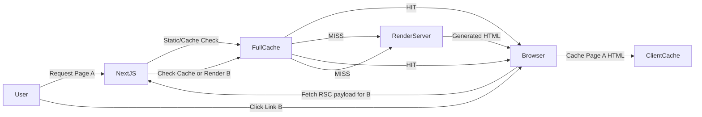

# บทสรุปผู้บริหาร

เพื่อให้เว็บแอปตอบสนองดุจ “แทบไม่มีดีเลย์” (perceived zero-latency) ในการเปลี่ยนหน้าหรือโต้ตอบกับผู้ใช้ ทีมวิศวกรรมเว็บสมัยใหม่ใช้ชุดเทคนิคที่หลากหลาย โดยผสมผสาน **การเรนเดอร์แบบสแตติก/ดึงข้อมูลก่อนล่วงหน้า (SSG/ISR)**, **เรนเดอร์หน้าเมื่อขอ (SSR)**, **สตรีมมิ่ง UI และ Suspense**, **Prefetching**, **SPA navigation**, **เทคนิคแคช (stale-while-revalidate)**, **Server Actions/Optimistic UI**, **Realtime updates** และ **PWA/Service Worker** เข้าด้วยกัน ระบบเหล่านี้ช่วยให้ส่วนใหญ่ของเนื้อหาและโครงสร้างถูกโหลดไว้ล่วงหน้า หรือแสดงผลทันที พร้อมกับดึงข้อมูลใหม่จากแบ็คเอนด์เบื้องหลัง ซึ่งช่วยลดความรู้สึกหน่วงและรักษาความสดใหม่ของข้อมูล ในขณะเดียวกันก็มีการจัดการแลกเปลี่ยนข้อมูลแบบ **สเตล-ไวลด์ (stale-while-revalidate)** เพื่อตอบสนองทันทีแม้ข้อมูลจะเริ่มเก่าแล้ว เทคนิคเหล่านี้ใช้งานร่วมกับ **Next.js App Router (v16)** ที่มีระบบแคชหลายชั้น และ **Supabase** ในฐานะฐานข้อมูลเชิงสัมพันธ์ที่ให้บริการ realtime ซึ่งช่วยให้มีข้อมูลอัปเดตทันทีโดยใช้ WebSocket ในการสื่อสาร (while Next.js ทำหน้าที่เรนเดอร์ UX ทันที) นอกจากนี้ยังใช้ **Service Worker/PWA** สำหรับแคชทรัพยากรและให้บริการผู้ใช้ในโหมดออฟไลน์ โดยทั้งหมดนี้ต้องระวังประเด็น **ความสอดคล้องของข้อมูล** (data consistency) และ **ความปลอดภัย** โดยเฉพาะอย่างยิ่งการยืนยันผู้ใช้ใน Server Actions/Roles และจัดการแคชให้ไม่แสดงข้อมูลล้าสมัยเกินไป  

**เทคนิคสำคัญที่ใช้กันในปัจจุบัน ได้แก่:**  
- **Static Generation (SSG/ISR)**: Pre-render หน้าส่วนใหญ่เป็น HTML ล่วงหน้าและแคชไว้ ทำให้โหลดหน้าแรกทันที (fast initial paint)  
- **Server-side Rendering (SSR) + Full Route Cache**: เรนเดอร์บนเซิร์ฟเวอร์แล้วเก็บผลลัพธ์ไว้ตามต้องการ ลดงานเรนเดอร์ซ้ำในการนำทางรอบถัดไป  
- **SPA Navigation & Prefetch**: ใช้ Next.js `<Link>` และเทคนิค prefetch/partial-prefetch เพื่อนำเนื้อหาล่วงหน้าในฝั่งไคลเอนต์ ลดดีเลย์ในการเปลี่ยนหน้า  
- **Client-side Caching / SWR**: ใช้แนวคิด stale-while-revalidate ใน React (เช่น SWR หรือ React Query) แสดงข้อมูลเก่าให้เร็วที่สุด แล้วรีเฟรชใหม่เบื้องหลัง  
- **Streaming & Suspense**: ใช้ React Server Components และ Suspense ใน Next.js เพื่อสตรีม UI ออกมาทีละส่วน แสดง skeleton เร็วขึ้นและเติมเนื้อหาเต็มเมื่อพร้อม  
- **Server Actions & Optimistic UI**: เมื่อมีการเปลี่ยนข้อมูล ใช้ Next.js Server Actions เพื่อทำงานฝั่งเซิร์ฟเวอร์และส่ง UI ใหม่กลับมาพร้อมกันในรอบเดียว จึงอัปเดตหน้าได้รวดเร็ว  
- **Realtime Data (Supabase)**: ใช้ Supabase Realtime ผ่าน WebSocket ที่ฟังการเปลี่ยนแปลง Postgres เพื่อดึงข้อมูลสดมาอัปเดต UI โดยไม่ต้องโหลดหน้าใหม่ (เหมาะกับฟีดหรือแชท)  
- **PWA/Service Worker**: แคช Assets และผลการเรียก API ใน service worker (เช่น stale-while-revalidate) เพื่อให้แอปทำงานได้แม้ออฟไลน์ และเตือนผู้ใช้ด้วย Web Push  

ต่อไปจะอธิบายรายละเอียดแต่ละเทคนิค วิธีทำงาน เหตุผลที่ช่วยลดเวลารับรู้ ความเหมาะสม (ข้อมูล static vs real-time) และตัวอย่างการใช้งานจริง พร้อมแนวทางติดตั้งใน Next.js 16 App Router, การเชื่อมต่อกับ Supabase, การใช้ร่วมกับ Service Worker/PWA, รวมถึงประเด็นด้านความปลอดภัยและความสอดคล้องของข้อมูล  แต่ละเทคนิคจะมีการอ้างอิงเอกสารหลักและบล็อกวิศวกรรมที่เชื่อถือได้ เพื่อให้ข้อมูลครบถ้วนและเป็นทางการ

## การเรนเดอร์บนเซิร์ฟเวอร์และการแคช

**1. Static Generation (SSG/ISR)** – สร้างหน้า HTML ล่วงหน้าตอน build เวลา โดยแทบไม่มีดีเลย์เมื่อผู้ใช้เปิดหน้าเพราะแค่ดึงไฟล์จาก CDN ตอบสนอง (perceived instant load). Next.js รองรับการปรับผลลัพธ์ทุกช่วงเวลา (Incremental Static Regeneration) ผ่านตัวเลือก `revalidate` ในการเรียก `fetch` หรือการเรียก `revalidatePath()` จาก Server Action เพื่อรีแคชเฉพาะหน้า . วิธีนี้เหมาะกับข้อมูลที่ **อัปเดตไม่บ่อย** (เช่น บทความข่าวโปรโมชันสินค้า ฯลฯ) เพราะช่วยให้โหลดเร็ว แต่แลกกับความสดใหม่ของข้อมูลที่อาจไม่อัปเดตแบบเรียลไทม์ จึงต้องกำหนดเวลาการ revalidate ที่สมเหตุสมผล ใน Next.js สามารถตั้งค่าเช่น `export const revalidate = 60` (วินาที) เพื่อบอกให้รีสร้างเพจใหม่ทุก 1 นาที หรือใช้ `revalidateTag()` เพื่อกลุ่มข้อมูล. โค้ดตัวอย่าง (Next.js App Router):

```tsx
// app/products/[id]/page.tsx
export default async function ProductPage({ params }) {
  const product = await fetch(`https://api.example.com/products/${params.id}`, {
    next: { revalidate: 60 }
  }).then(res => res.json());
  return <ProductDetail product={product} />;
}
```

**ข้อดี:** โหลดเร็วสุด (แทบไม่รอนาน) เพราะดึง HTML แบบ static จากแคช, ลดงานเรนเดอร์.  
**ข้อเสีย:** อาจมี **ความล้าสมัย** ขึ้นกับ revalidate, ไม่เหมาะกับข้อมูลเปลี่ยนบ่อย. ต้องจัดการกรณีข้อมูลสำคัญเปลี่ยน (เช่น ใช้ Webhook กระตุ้น revalidate เมื่อข้อมูลใน Supabase เปลี่ยน).  
**สถานการณ์เหมาะสม:** หน้าเนื้อหา, บทความ, สินค้า คงตัว.

**2. Server-side Rendering (SSR) + Full Route Cache** – เมื่อใช้ SSR (`dynamic='force-dynamic'` หรือไม่ตั้งค่า `cache`), Next.js จะเรนเดอร์ HTML ทุกครั้งแต่สามารถ **เก็บแคชผลลัพธ์** ได้ (Full Route Cache). ครั้งแรกต้องรอเรนเดอร์ แต่ครั้งต่อๆ ไป (ถ้าแคชไม่หมดอายุหรือไม่ได้เรียก `no-store`) ก็ให้ผลลัพธ์เดิมทันทีลดดีเลย์. ใช้ได้ทั้งในโหมด Edge หรือ Node. เหมาะกับหน้าที่ **เปลี่ยนบ่อยขึ้น** แต่ไม่ต้องเปลี่ยนทุกคำขอ เช่น Dashboard สรุปข้อมูล (refresh ทุกนาที), หรือหน้าเนื้อหา dynamic ผสมฐานข้อมูล. Next.js ช่วยสนับสนุนการปรับแคชละเอียดด้วย Header `Cache-Control`, ตัวเลือกใน `fetch` เช่น `{cache: 'force-cache', next: {revalidate: 60}}` หรือตั้ง `export const revalidate = 0` เพื่อไม่แคช (no-store).  

**ข้อดี:** ผสมระหว่างประสิทธิภาพและความสดใหม่, ข้อมูลส่วนใหญ่กรณีไม่แคชก็ SSR ได้เสมอ.  
**ข้อเสีย:** ถ้าไม่ใช้แคช ช้ากว่า SSG, ถ้าแคชก็เสี่ยงข้อมูลเก่า. ต้องจัดการ revalidate เอง.  
**สถานการณ์เหมาะสม:** หน้าที่ต้องการข้อมูลอัปเดตบ่อย เช่น feed, แดชบอร์ด (แต่ไม่ต้องรีเฟรชบ่อยๆ), ส่วนที่ต้องการออโธเซ็นฯรองรับ SSR.

**การจัดการแคช:** Next.js มีระบบแคชหลายระดับ – เช่น *Request Memoization* (ป้องกัน fetch ซ้ำใน tree เดียว), *Data Cache* (cache เก็บข้อมูลข้ามคำขอ, ใช้ร่วมกับ `fetch` option), *Full Route Cache* (cache HTML/RSC), *Router Cache* (cache ในลูกข่าย/เบราว์เซอร์เพื่อ reuse RSC payload). เริ่มต้นจะ “cache เท่าที่ทำได้” ผู้ใช้จึงได้รับสิ่งที่โหลดเร็วที่สุดโดยไม่ต้องคอนฟิกมาก. นอกจากนั้น **Layout** ของ Next.js App Router จะไม่ re-render ซ้ำบนการนำทางข้ามเพจ ช่วยให้ transitions รวดเร็วเพราะโครงสร้าง UI หลักไม่เปลี่ยน.



## การดึงข้อมูลและกลยุทธ์แคช (stale-while-revalidate)

**3. Stale-While-Revalidate (SWR) / SWR Library** – แนวคิดที่ใช้ใน SWR (Vercel) และ React Query คือ “เสิร์ฟข้อมูลจากแคชก่อน แล้วรีเฟรชข้อมูลใหม่แบบเงียบ”. ตัวอย่างเช่น เมื่อผู้ใช้ไปยัง feed หน้าแรก เราอาจมีข้อมูลล่าสุดเก็บในแคชไว้ (จากคำขอก่อนหน้า) จึงแสดงขึ้นทันที แล้วเบื้องหลังเรียก API ดึงข้อมูลใหม่มาอัปเดต UI. ประโยชน์คือความรู้สึกว่าข้อมูลปรากฏทันที “zero load time” แต่เมื่อข้อมูลเก่าไปแล้ว (เช่น เกินช่วงเวลาที่กำหนดใน stale-while-revalidate) จึงโหลดจากเครือข่ายใหม่ทั้งหมด. SWR เหมาะกับข้อมูลที่ “เปลี่ยนเป็นระยะ” (เช่น สภาพอากาศ ข่าวรายชั่วโมง). Next.js 16 มี API ช่วยเช่น `revalidateTag()` หรือการตั้ง `fetch` option `{ next: { revalidate: N } }` ทำงานคล้ายกัน. ในฝั่งไคลเอนต์ ช่วยได้โดยการใช้ hook SWR (`useSWR`) หรือ Next.js API เช่น `router.refresh()` เพื่อดึงข้อมูลใหม่. 

ตัวอย่าง (React Client Component) ใช้ SWR:

```tsx
import useSWR from 'swr';
const fetcher = url => fetch(url).then(r => r.json());
export default function Feed() {
  const { data, error } = useSWR('/api/feed', fetcher, { refreshInterval: 60000 });
  if (!data) return <Loading />;
  return data.posts.map(post => <PostItem key={post.id} data={post} />);
}
```

เมื่อผู้ใช้เปิดเพจ `Feed` ครั้งแรก ข้อมูลเก่าถ้ามีจะถูกแสดงทันที (แม้จะ stale) จากนั้น SWR ดึงข้อมูลใหม่เบื้องหลังและอัปเดต. 

**ข้อดี:** ลดการรอข้อมูล เพิ่ม perceived performance ด้วยการแสดงอย่างรวดเร็ว.  
**ข้อเสีย:** ข้อมูลอาจ **เก่า** ไปเล็กน้อย ถ้ามีการอัปเดตเกิดขึ้นระหว่างนั้น – แต่ใช้กลยุทธ์รีเฟรชมักจะแก้ไขได้เร็ว.  
**สถานการณ์เหมาะสม:** ฟีดข่าว โพสต์ คอมเมนต์ หรือข้อมูลที่อัปเดตไม่จำเป็นต้องสดมากทันที (เช่น ข้อมูลสภาพอากาศ อัตราแลกเปลี่ยน).

## การนำทางฝั่งไคลเอนต์และ Prefetching

**4. SPA-style Navigation & `<Link>` Prefetch** – แอปสมัยใหม่นิยมใช้แนวทาง Single Page Application (SPA) เพื่อให้เปลี่ยนหน้าโดยไม่โหลดเพจใหม่ทั้งหมด หลังแอปโหลดครั้งแรก, Next.js App Router จะแปลงการคลิก `<Link>` ให้ขอข้อมูลเฉพาะส่วนที่จำเป็นจากเซิร์ฟเวอร์ (RSC payload, json + code) และแสดงหน้าใหม่ทันทีในฝั่งไคลเอนต์ ภาพรวมคือ หน้า UI หลัก (layout) อยู่แล้วในหน่วยความจำ จึงไม่ต้องโหลดใหม่ทั้งหมด. นอกจากนี้ Next.js จะ **prefetch** เนื้อหาเพจอื่นๆ ตามโอกาส เช่น เมื่อ `<Link>` โผล่ใน viewport หรือมี hover บนลิงก์, จะส่งคำขอเรียกหน้าล่วงหน้าไว้ในแคชของเบราว์เซอร์. Next.js 16 ยังปรับปรุงเป็น *Layout Deduplication* และ *Incremental Prefetching*: หากลิงก์หลายอันใช้ layout ร่วมกัน ก็จะโหลด layout เพียงครั้งเดียว (ประหยัดการรับส่ง), และเมื่อมีการ prefetch จะดึงเฉพาะส่วนที่ยังไม่มีในแคช (แทนดึงทั้งหน้า). ทำให้หลังจากโหลดหน้าแรก ผู้ใช้คลิกหน้าต่างๆ รู้สึกทันทีเพราะโหลดข้อมูลมาเตรียมไว้ก่อนแล้ว. 

ตัวอย่าง Next.js 16: `<Link>` โดยทั่วไป prefetch อัตโนมัติ (ใน production) ถ้าต้องการหยุด prefetch ใช้ `prefetch={false}`. และสามารถใช้ `router.prefetch('/about')` เรียกเอง.

```tsx
// pages/_app.tsx
import Link from 'next/link';
export default function App() {
  return (
    <Link href="/about">
      <a>About (Prefetched)</a>
    </Link>
  );
}
```

เทคนิคนี้ได้รับการใช้โดยเว็บแอปรายใหญ่ (เช่น การโหลดหน้าโปรไฟล์ของ Facebook ก่อนผู้ใช้คลิกลิงก์โปรไฟล์) เพื่อให้การนำทางราบรื่น รวดเร็ว (perceived instant navigation). 

**ข้อดี:** ลดการโหลดใหม่ของหน้าทั้งหมด เปลี่ยนหน้าได้เร็วเพราะเรียกแต่ส่วนที่จำเป็น.  
**ข้อเสีย:** เพิ่มคำขอเครือข่ายเบื้องหลัง (prefetch หลายลิงก์) และต้องมี JavaScript รองรับ (จึงอาจช้าหลังโหลดครั้งแรกเล็กน้อย). ถ้า prefetch มากเกินไปอาจก่อภาระเครือข่ายได้ (แต่ Next.js 16 ปรับปรุงเพื่อลดภาระนี้แล้ว).  
**สถานการณ์เหมาะสม:** แอปที่ผู้ใช้เปลี่ยนหน้าเร็วๆ มีประสบการณ์การใช้งานต่อเนื่อง เช่น หน้าโปรไฟล์, แกลเลอรี่รูป, หรือ path กลุ่มเนื้อหาที่ผู้ใช้มักคลิกถัดไป.

## Streaming UI และ React Server Components

**5. Streaming / Suspense** – Next.js App Router สร้างบน React 18+ รองรับการสตรีม UI จากเซิร์ฟเวอร์มาแบบส่วนต่อส่วน (React Server Components + Suspense). เมื่อเปิดหน้าใหม่ องค์ประกอบหลัก (layout/header) สามารถเรนเดอร์และส่งมาทันทีโดยไม่ต้องรอส่วนลึกสุดพร้อม (เพราะถูกแบ่งเป็น Suspense boundary) แล้วค่อยเติมข้อมูลลงแต่ละส่วนเมื่อ fetch ครบ. ช่วยให้เห็น UI เบื้องต้นเร็วขึ้น (เช่น skeleton loader หรือ placeholder) ขณะที่ส่วนอื่นๆ กำลังโหลด. ตัวอย่าง: มี `<Suspense>` ครอบส่วนที่เชื่อมข้อมูลหนักๆ ถ้าข้อมูลช้า ก็แสดงโครงร่าง (loading) ก่อน. การสตรีมนี้ลด First Contentful Paint ช่วยให้ผู้ใช้รู้สึกว่า “โหลดเร็ว” แม้จะยังไม่ครบ 100%. Next.js ช่วยด้วยไฟล์ special อย่าง `loading.js` (หรือการใช้ `<Loading/>` component) ที่แสดงระหว่างรอ.

```tsx
// app/dashboard/page.tsx
export default function DashboardPage() {
  return (
    <Suspense fallback={<Loader />}>
      <LargeChart />  {/* เรียก useEffect หรือ fetch ข้อมูล chart */}
    </Suspense>
  );
}
```

นี่หมายความว่า ตัว `<LargeChart>` ถ้าโหลดข้อมูลช้า Next.js จะแสดง `<Loader />` ก่อน และสตรีม `<LargeChart>` มาเติมทีหลัง (streamed HTML).

**ข้อดี:** เนื้อหาไม่ต้องรอพร้อมทั้งหมดก่อนแสดง, ลดเวลารอเห็นบางอย่างบนหน้า (Perceived speed).  
**ข้อเสีย:** ซับซ้อนขึ้นในการจัดองค์ประกอบและ fallback; ต้องออกแบบ loading UI ดีๆ.  
**สถานการณ์เหมาะสม:** หน้าแรกที่ต้องโหลดหลายส่วน, UI ขนาดใหญ่, feed รูปภาพเยอะ หรือข้อมูลหนักๆ (เช่น กราฟ, แผนที่) – แสดง placeholder ขึ้นก่อน แล้วค่อยเติมอย่างราบรื่น.

## Server Actions & Optimistic UI

**6. Server Actions (Next.js 13+)** – เป็นฟีเจอร์ใหม่ที่ทำให้การส่งข้อมูลหรือทำงานฝั่งเซิร์ฟเวอร์ง่ายกว่าการเรียก API ปกติ: เราประกาศฟังก์ชันแบบ `async function` ที่รันบนเซิร์ฟเวอร์ (“ใช้ directive `use server` ใน Next.js 13”) และเรียกจากฝั่งลูกข่าย (ผ่าน `<form action={func}>` หรือ `<button formAction={func}>`). เมื่อเรียกใช้งาน Next.js จะทำ POST ให้และ **ส่งกลับทั้ง UI ที่อัปเดตและข้อมูลใหม่ในรอบการติดต่อเดียว**. กล่าวคือ การกดปุ่มเช่น “บันทึก” แล้วจะได้รับผลลัพธ์ล่าสุดพร้อมอัปเดตหน้าโดยไม่ต้องทำ fetch สองครั้ง. นอกจากนี้ Next.js ยังรองรับฟังก์ชัน `revalidatePath()` หรือ `revalidateTag()` ภายใน Server Action เพื่อรีเฟรชหน้า/ข้อมูลหลังเปลี่ยนแปลง. ตัวอย่าง: 

```tsx
// app/profile/edit/page.tsx
export default function EditProfile() {
  async function updateProfile(data) {
    "use server";
    await db.updateUser(data);        // ทำงานบนเซิร์ฟเวอร์
    revalidatePath('/profile');       // รีเฟรชข้อมูลหน้าโปรไฟล์
  }

  return (
    <form action={updateProfile}>
      <input name="name" defaultValue="Alice"/>
      <button type="submit">Save</button>
    </form>
  );
}
```

เมื่อผู้ใช้กด *Save*, หน้า `/profile` จะถูก revalidate แบบ on-demand โดยเฉพาะหน้านี้ เพื่อแสดงข้อมูลใหม่ทันที. การใช้ Server Actions ช่วยให้ UI รู้สึกตอบสนองเร็ว (หนึ่งรอบ trip เดียว) และเขียนโค้ดง่ายขึ้นเพราะไม่ต้องแยกไฟล์ API ปกติ. 

**ข้อดี:** ลดเวลาแฝงโดยส่ง UI ใหม่พร้อมกันทันที, เขียนโค้ดสะดวกกว่าการสร้าง API route เอง, ใช้ `startTransition` ใน React ทำ Optimistic UI ได้.  
**ข้อเสีย:** ต้องระวังเรื่อง **ความปลอดภัย** – เนื่องจากเปิดให้เรียก Server Action ผ่าน POST ใดๆ ได้, ต้องตรวจสอบสิทธิ์ทุกครั้งในฟังก์ชัน (เช่น เช็ก auth token, RLS). หากไม่จัดการดีๆ อาจโดน CSRF หรือเผยข้อมูลไม่ตั้งใจ.  
**สถานการณ์เหมาะสม:** การอัปเดตข้อมูล (ฟอร์ม, กดไลก์, แก้ profile ฯลฯ) ที่ต้องการ instant feedback กับผู้ใช้, โดยเฉพาะเมื่อสิ่งที่เขียนโค้ด server action สามารถสั่ง revalidate ข้อมูลได้ทันที.

## Real-time Data และ Supabase

**7. Realtime Data (Supabase / WebSocket)** – สำหรับกรณีต้องการข้อมูลสดสุดๆ เช่น แชท, ฟีดข่าวเรียลไทม์, หรืองานร่วมแบบ collaborative, ใช้ระบบ realtime ได้. Supabase มีฟีเจอร์ Realtime ที่ต่อด้วย WebSocket ไปยังเซิร์ฟเวอร์ (ฟัง Pub/Sub ของ Postgres) เมื่อข้อมูลในตารางมีการ INSERT/UPDATE/DELETE ก็จะไลฟ์ไปยังไคลเอนต์. เราสามารถ subscribe ใน Next.js เช่น:

```tsx
// React component
useEffect(() => {
  const channel = supabase
    .channel('public:posts')
    .on('postgres_changes', { event: '*', schema: 'public', table: 'posts' }, payload => {
      setPosts(prev => [payload.new, ...prev]); // update UI
    })
    .subscribe();
  return () => { supabase.removeChannel(channel); }
}, []);
```

เมื่อมีโพสต์ใหม่จากผู้ใช้คนอื่น UI จะแสดงทันที โดยไม่ต้อง refresh หน้า. วิธีนี้ให้ประสบการณ์เหมือน “instant” เพราะผู้ใช้เห็นผลลัพธ์เรียลไทม์. อย่างไรก็ดี ข้อมูลที่ได้รับจะถูกนำมาเพิ่มใน UI และอาจมีสถานะ “สเตลก่อนอัพเดต” เล็กน้อยระหว่าง broadcast. การผนวกกับ SWR หรือ React state ที่มีแคช (stale) จะช่วยลด flicker. 

**ข้อดี:** ข้อมูลสดทันใจ (update push), ลดการ poll สม่ำเสมอ.  
**ข้อเสีย:** สร้างภาระ WebSocket ต่อตัวลูกข่าย (คนดูฟีดหลายคน), ยุ่งยากกับ offline (ถ้าออฟไลน์จะไม่รับ update). ต้องจัดการ fallback กรณีหลุด connection (ทำ reconnect).  
**สถานการณ์เหมาะสม:** แชท, ข้อมูลแชร์หรือเกม, feed ที่คนใช้งานพร้อมกันหลายคน (แต่ถ้าเนื้อหาไม่เปลี่ยนบ่อย เลือกใช้ SWR จะง่ายกว่า). 

การผสาน Supabase กับ Next.js มักทำบน **Client Components** (เพื่อใช้ SWR หรือ useEffect subscribe) ร่วมกับ SSR/SSG ในการโหลดข้อมูลเริ่มต้น ซึ่งยังช่วยโหลดเพจแรกเร็ว ส่วน Supabase offline ปกติมีจำกัด (ต้องใช้งานคล้าย React offline patterns หรือ IndexedDB เพิ่มเติม).  

## PWA และ Service Worker

**8. Progressive Web App / Service Worker** – การใช้ Service Worker (เช่นผ่านแพ็กเกจ next-pwa หรือเขียน sw.js เอง) ให้แอปเว็บมีคุณสมบัติใช้งานออฟไลน์และรองรับ Push Notifications. เทคนิคสำคัญคือการกำหนดนโยบายแคช (Cache Strategy) ใน SW:

- *Precache Static Assets:* บันเดิลไฟล์ JS, CSS, รูปภาพ, font ฯลฯ แพ็กไว้ใน Cache-On-Install ทำให้แอปโหลดส่วนสำคัญได้แม้ออฟไลน์ (app shell).  
- *Runtime Cache for API:* ใช้กลยุทธ์ stale-while-revalidate สำหรับ API calls (static assets) หรือ dynamic caching policies (เช่น NetworkFirst สำหรับ API สำคัญ, CacheFirst สำหรับรูปส่วน UI) เพื่อให้ให้ตอบสนองได้เร็วโดยใช้แคชเก่าแล้วรีเฟรชเบื้องหลัง.  
- *Background Sync / Push:* ใช้ Web Push แจ้งเตือนผู้ใช้เมื่อมีการเปลี่ยนแปลงสำคัญ (เช่น ข้อความใหม่). ถ้าออฟไลน์ สามารถ sync ฐานข้อมูลเบื้องหลังเมื่อกลับมาออนไลน์หรือใช้ Service Worker Cache เพื่อดึงข้อมูลล่าสุด.  

ตัวอย่าง (Workbox ซึ่งเข้าใจง่าย):

```js
// sw.js (Workbox strategy)
workbox.routing.registerRoute(
  ({url}) => url.origin === self.location.origin && url.pathname.endsWith('.json'),
  new workbox.strategies.StaleWhileRevalidate({cacheName: 'api-cache'})
);
```

**ข้อดี:** ให้เว็บทำงานได้แม้ออฟไลน์, โหลดไวเพราะใช้ไฟล์จากแคช, ทำให้แอปเหมือน Native.  
**ข้อเสีย:** เพิ่มความซับซ้อน (เขียน SW, จัดการแคช, update แคช), ต้องระวัง **Consistency** – ถ้าแคชข้อมูลเก่าเกินไปอาจให้ผู้ใช้เห็นข้อมูลไม่ล่าสุด. ต้องมีวิธีแจ้งผู้ใช้เมื่อแอปอัปเดต.  
**สถานการณ์เหมาะสม:** แอปที่ต้องรองรับใช้งานติดตั้ง (installed), เช่น PWA, ระบบแจ้งเตือน, หรือกรณีเนื้อหาสำคัญที่ยังต้องให้ user เข้าถึงแม้ออฟไลน์ (ข่าว, ผลการค้นหา, คลังรูป).  

ส่วนของ **Web Push** เป็นการเพิ่มเติมในการแจ้งเตือน (e.g. Supabase Edge Function ส่ง push เมื่อ DB เปลี่ยน) – ช่วยดึงคนกลับมาเปิดแอป เพราะเห็นการแจ้งเตือน (เช่น “เรื่องใหม่โพสต์แล้ว”). 

## ความปลอดภัยและความสอดคล้อง

ทุกเทคนิคข้างต้นต้องจัดการกับประเด็นด้าน **ความปลอดภัย** และ **ความสอดคล้องของข้อมูล** 

- **การตรวจสอบสิทธิ์ (Auth/RLS):** เมื่อใช้ Server Actions หรือ API route ใดๆ ต้องเช็ก token และสิทธิ์ภายในฟังก์ชันทุกครั้ง. Supabase ใช้ RLS (Row Level Security) บังคับให้ client ไม่สามารถขอข้อมูลเกินสิทธิ์ได้.  
- **CSRF/XSS:** Server Actions ป้องกัน CSRF บางส่วน (เพราะเรียกผ่าน POST จาก same-site), แต่ฝั่ง client ต้องระวัง injection หากใช้ `dangerouslySetInnerHTML`. ต้องตั้ง CSP (Content Security Policy) ใน Next.js config.  
- **Data Consistency:** แนวทาง caching และ realtime ทำให้ข้อมูลอาจ stale เล็กน้อย. ต้องเลือก strategy ให้เหมาะ: อาจใช้ SWR+ขีดจำกัดเวลา (refresh) หรือสอดคล้องกับ Event ที่เปลี่ยนข้อมูล (Webhooks -> revalidate). ตรวจสอบสถานะ network เมื่อ offline เช่น ให้ user รู้ว่าข้อมูลกำลังเก่า.  
- **สเกลและค่าใช้จ่าย:** Prefetch หรือ realtime เยอะๆ อาจเพิ่มภาระเครือข่าย/DB. ควร throttle หรือตั้งเงื่อนไข (เช่น prefetch เมื่อ user hover เท่านั้น).

## เทคนิคจากกรณีศึกษาของแอปใหญ่

แอปฯ ชื่อดังหลายแห่งผนวกเทคนิคเหล่านี้เพื่อความเร็วของ UI: 

- **Facebook/Instagram:** ใช้ GraphQL/Apollo หรือ Relay เพื่อโหลดข้อมูลเป็น GraphQL Fragment (แบบ partial fetch) และทำ "skeleton UI" แสดงก่อน. มีระบบ prefetch ส่วนต่อขยายหน้า (เช่น เมื่อเลื่อน feed) รวมถึง Optimistic UI ตอนกดไลก์/คอมเมนต์. Mobile app ของ Instagram ใช้ React Navigation ที่ prefetch รูปและข้อมูลล่วงหน้า.  
- **Twitter:** เดิมใช้ PJAX (partial AJAX) โหลดโพสต์ใหม่แทนโหลดหน้าใหม่ทั้งหมด. ปัจจุบันใช้ React + GraphQL ส่งข้อมูลเฉพาะส่วนที่เปลี่ยนและ Virtual DOM diff. รองรับ infinite scroll prefetch data. อาจมีเทคนิค stale-while-revalidate กับ home timeline.  
- **Notion/Frame.io:** ตัวอย่างบริษัทที่เคลมว่า UI ตอบสนองภายใน 100ms ใช้ Next.js/React ด้วย **SSR + Streaming + Suspense** เพื่อให้ layout โผล่ก่อน.  

เทคนิคเหล่านี้ล้วนให้ความรู้สึก “เร็วทันใจ” แก่ผู้ใช้ โดยโหลดบางส่วนหรือข้อมูลส่วนสำคัญก่อน และอัพเดตส่วนอื่นแบบอะซิงค์ ทำให้หน้าดูเหมือนเปลี่ยนทันที.

## ตารางเปรียบเทียบเทคนิค

| เทคนิค                        | Latency Profile           | ความซับซ้อน   | Staleness                      | กรณีใช้งาน             | จุดแนะนำใน Next.js        |
|------------------------------|---------------------------|----------------|-------------------------------|-------------------------|--------------------------|
| Static Generation (SSG)      | หน่วง <50ms (CDN)         | ต่ำ (easy)     | ปรับได้ด้วย revalidate (อาจ stale)  | หน้าเนื้อหา ไม่ค่อยเปลี่ยน | `export const revalidate = N`, `fetch(...,{ next:{revalidate} })` |
| ISR (Incremental SR)         | หน่วง <50ms (หลัง build)   | ต่ำถึงปานกลาง  | ใช้ revalidate: นานสุดข้อมูลอาจ stale | บทความ สินค้า, CMS       | เหมือน SSG + `revalidate = 60` |
| SSR + Full Route Cache       | ครั้งแรก ~100-300ms        | ปานกลาง         | Cache ขึ้นกับ config (revalidate)    | Dashboard, หน้าเน้น auth | `fetch({cache:'force-cache'})`, Edge caching |
| CSR / SPA Navigation         | ครั้งแรก 100-500ms (ใหญ่)   | ต่ำ             | สูง (data fetch on demand)        | แอปอินเทอร์แอคทีฟสูง      | `<Link>`, `router.push()`, Client Components |
| Prefetch (Incremental)      | Click ถัดไป ~0ms (if cached) | ต่ำ             | –                              | ทุกลิงก์ที่มีโอกาสคลิก     | `<Link prefetch>`, `router.prefetch()`, Next.js 16 auto |
| Suspense/Streaming UI        | UI ลอยเร็ว (<100ms)        | ปานกลาง         | –                              | หน้าที่มีส่วนโหลดหนัก      | `<Suspense>`, `loading.js` |
| Stale-While-Revalidate (SWR) | แสดง cached ทันที, network fetch ใส่เบื้องหลัง | ปานกลาง (ต้อง config) | โดยปรับค่า max-age/stale  | ข้อมูลสื่อสาร (ข่าว, โพสต์) | SWR hook, `{ next:{revalidate} }` |
| Optimistic UI / Server Actions | UI update ~0-100ms         | ปานกลางถึงสูง   | –                              | ฟอร์ม/ออปเจ็กต์ต้องตอบสนองเร็ว | `use server` action, `revalidatePath()` |
| Realtime (WebSocket)        | แทบไม่มีดีเลย์ (push)      | สูง (infrastructure) | ขึ้นกับ server ใหม่ทันที         | แชท, ฟีดสด               | Supabase `subscribe()`, Edge SSE |
| Service Worker (PWA)        | Asset <50ms (cache)         | ปานกลางถึงสูง   | ขึ้นกับนโยบาย (stale แต่มี revalidate) | แอปใช้งาน offline, องค์ประกอบคงที่ | `next-pwa`, `workbox` |

*Latentcy Profile:* โดยประมาณหลังโหลดครั้งแรก (CSS/JS ถูกโหลดเรียบร้อย). *Complexity:* ความยากในการติดตั้ง / บำรุงรักษา. *Cache Staleness:* ระดับข้อมูลอาจล้าสมัย. *Next.js Pointer:* ตัวอย่างโค้ดหรือ config, **App Router** support. 

**ตัวอย่างโค้ด/Config Next.js:**  
- กำหนด ISR: `export const revalidate = 60;` ในไฟล์เพจเพื่อ re-gen ทุก 60 วินาที.  
- ใช้ Server Actions: ใน Component ให้ `async function handler(){ "use server"; ...}` และ `<form action={handler}>`.  
- ใช้ Prefetch: Next.js 16 ทำให้อัตโนมัติ แต่ถ้าต้องการปิด `<Link prefetch={false}>`.  
- Service Worker: ติดตั้ง via `next-pwa` plugin หรือเขียนไฟล์ `public/sw.js` ด้วย Workbox.

**สรุป:** เทคนิคเหล่านี้ไม่ใช่การคาดการณ์ลอยๆ แต่ใช้งานจริงในเว็บใหญ่ (Facebook, Twitter, Notion, ฯลฯ) และการันตีผลลัพธ์ด้วยเอกสาร Next.js และกรณีศึกษา. แนวทางคือผสมระหว่าง pre-render และ dynamic update เพื่อให้ผู้ใช้สัมผัสได้ถึงความเร็ว (ลด perceivable latency) พร้อมกับรักษาความสดใหม่ตามความจำเป็น.

